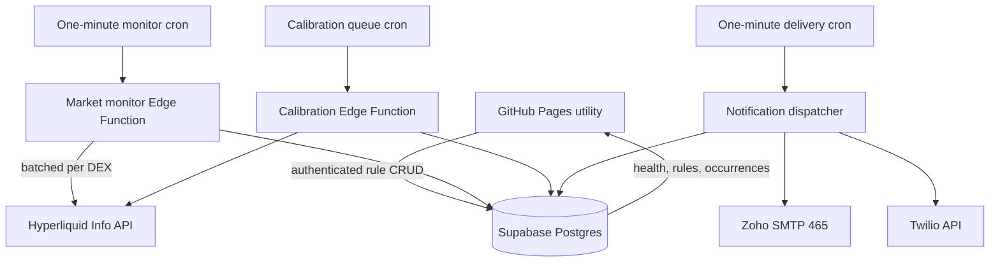
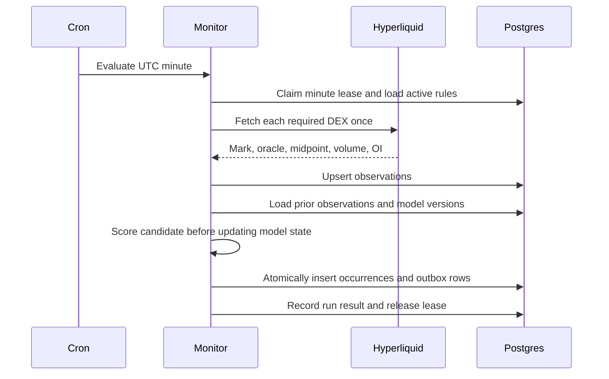
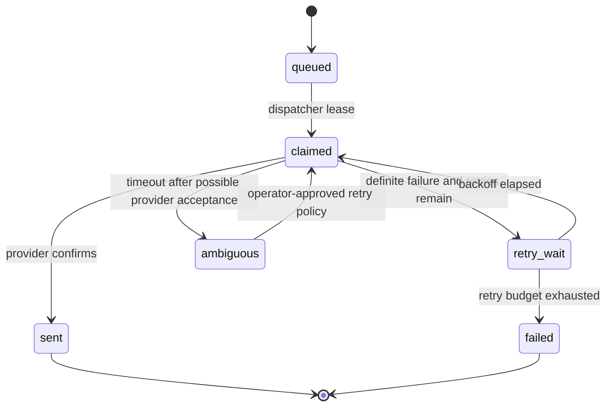
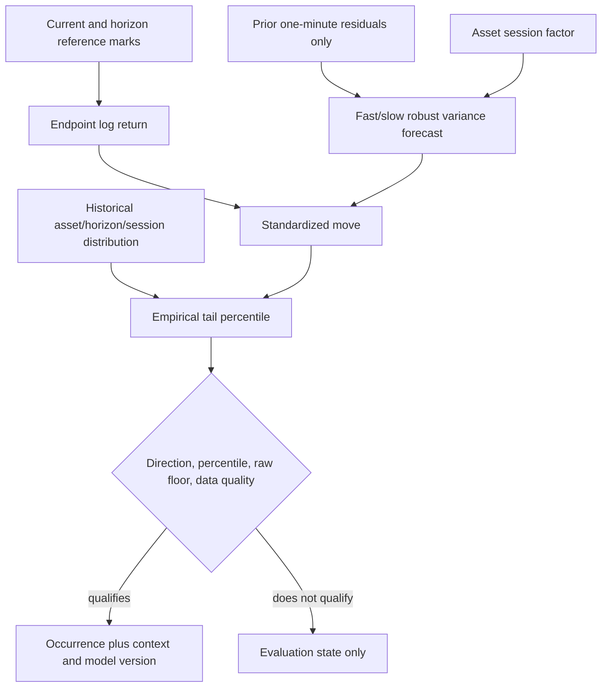

# Supabase Market Listener - Plan

## Goal Capsule

- **Objective:** Replace the GitHub-Issue alert monitor with a Supabase-hosted, one-minute listener that supports fixed-price alerts and statistically normalized large-move alerts without requiring an open browser.
- **Product authority:** The app remains a personal, minimal utility; only user-requested controls and status are added.
- **Execution profile:** Deep, cross-cutting change spanning Postgres, Edge Functions, scheduling, delivery, browser state, tests, deployment, and operational visibility.
- **Stop conditions:** Stop if the hosted Supabase project cannot run authenticated cron-triggered Edge Functions, if Zoho SMTP on port 465 cannot operate from the Edge Runtime and no approved delivery adapter is available, or if production schema deployment cannot be performed safely with the available project credentials.
- **Tail ownership:** The implementation owns migrations, function deployment, cron creation, secret migration, production smoke verification, GitHub monitor retirement, and documentation.

---

## Product Contract

### Summary

Hyperdata will persist alert rules in Supabase and evaluate them once per minute even when no browser is open. The initial listener supports one-time fixed-price thresholds and recurring large-move rules, with every qualifying minute producing its own notification. A versioned detector boundary permits future chart-pattern and alternative data detectors without changing scheduling, persistence, or delivery.

### Problem Frame

The current monitor stores alerts as public GitHub Issues and asks GitHub Actions to inspect one price snapshot every five minutes. Recent scheduled runs occurred roughly hourly, so transient crossings can be missed and the system cannot calculate returns, volatility forecasts, empirical tail probabilities, or chart patterns. The browser already has live Hyperliquid data and Supabase authentication, but browser state cannot provide unattended alerting.

### Requirements

**Persistence and control**

- R1. Alert rules, evaluation state, detected occurrences, delivery attempts, and monitor health must persist centrally in Supabase and remain consistent across signed-in devices.
- R2. The authenticated personal user must be able to create, view, enable, disable, and delete rules from the existing Alerts view without using GitHub Issues or the Supabase dashboard.
- R3. Browser clients may manage only the signed-in user's rules; scheduled functions use server credentials and secrets that never ship to GitHub Pages.

**Monitoring and market data**

- R4. A server-side monitor must evaluate active rules in one-minute UTC buckets without requiring an open browser.
- R5. Each run must batch required assets by Hyperliquid perpetual DEX, capture mark, oracle, midpoint, open interest, and volume context, and reject stale, missing, or invalid observations rather than creating false occurrences.
- R6. Concurrent or repeated processing of the same one-minute bucket must be safe and must not create duplicate observations or occurrences.
- R7. The system must record monitor success, partial failure, duration, asset counts, rule counts, and the most recent successful evaluation so the UI can show whether alerts are healthy.

**Rule behavior**

- R8. Fixed-price rules retain inclusive above/below comparisons and disable themselves after their first recorded occurrence.
- R9. Large-move rules support one-minute and longer horizons, up/down/either direction, an empirical tail threshold, and an optional minimum absolute percentage move.
- R10. A large move must be scored from the endpoint log return against a volatility forecast built only from data preceding the candidate move, then calibrated against a historical distribution for the same asset, horizon, session, and model version.
- R11. Every newly evaluated minute that qualifies must create a new occurrence and notification; no event grouping, escalation suppression, daily quota, or cooldown is applied. (session-settled: user-directed — chosen over event-level grouping: alert frequency should follow the market and every qualifying occurrence is wanted.)
- R12. Reprocessing the same rule and minute must return the existing occurrence, while processing the next qualifying minute must create a distinct occurrence.
- R13. A rule whose calibration or reference data is insufficient must report a warming or data-gap state and must not claim a statistically calibrated anomaly.

**Notification delivery**

- R14. Detection and delivery must be decoupled through a durable outbox so a Zoho or Twilio outage cannot erase a detected occurrence or block later rule evaluations.
- R15. Email remains the default channel through the existing Zoho account; SMS remains available when Twilio is configured and is allowed to fail independently.
- R16. Normal evaluator reruns and dispatcher retries must not enqueue duplicate messages for one occurrence, while provider-ambiguous outcomes are recorded honestly because SMTP cannot guarantee exactly-once external delivery.
- R17. Failed messages must retry with bounded exponential backoff, retain the last provider error, and become visibly failed after the retry budget is exhausted.

**Extensibility and resource control**

- R18. Rule configurations and detector outputs must be versioned so future chart-pattern, volume, open-interest, or cross-asset detectors can reuse the collector, occurrence, outbox, and UI lifecycle.
- R19. Market history must have automatic retention and storage telemetry so routine personal use stays within the Supabase Free database allowance.
- R20. One scheduled invocation must evaluate all active rules in a batch; the design must not invoke one Edge Function per asset or rule.

### Key Flows

- F1. **Create a fixed alert:** The signed-in user submits an asset, direction, target, and channel; Supabase validates and stores the rule; the next monitor runs see it; the first qualifying observation creates an occurrence and disables the rule.
- F2. **Create a large-move listener:** The user selects an asset, horizon, direction, sensitivity, optional raw floor, and channel; calibration is backfilled or marked warming; each later qualifying minute creates a notification.
- F3. **Evaluate a minute:** Cron invokes the monitor; the monitor claims the UTC minute, loads active rules, batches market requests, persists observations, evaluates detector plugins, atomically creates occurrences/outbox rows, and records health.
- F4. **Deliver notifications:** A separate cron invokes the dispatcher; it claims due outbox rows, sends through the requested adapter, and records success, retry, ambiguous outcome, or terminal failure.
- F5. **Inspect health:** The Alerts view shows the last successful evaluation, current calibration status, active rules, recent occurrences, and failed deliveries without exposing service credentials.

### Acceptance Examples

- AE1. Given an above-price rule at 200 and a mark of 200, when its minute is evaluated, one occurrence is recorded, one message is queued, and the rule is disabled.
- AE2. Given a recurring large-move rule that qualifies at 12:00 and 12:01 UTC, when both buckets run, two occurrences and two notifications are created.
- AE3. Given the 12:00 bucket is invoked twice, when both invocations evaluate the same qualifying rule, only one 12:00 occurrence and one outbox message exist.
- AE4. Given the Hyperliquid request returns 429 or lacks a valid mark, when the monitor runs, no rule occurrence is created and health records the failure.
- AE5. Given Zoho is unavailable after an occurrence is committed, when the dispatcher runs, the occurrence remains durable and the outbox schedules a retry without blocking the next market evaluation.
- AE6. Given a large-move rule lacks enough calibration samples, when it is evaluated, it remains visible as warming and sends no statistically labeled alert.
- AE7. Given the mark and oracle move together, the occurrence is classified as an underlying move; given the mark diverges materially from a stable oracle, it is classified as a venue dislocation.
- AE8. Given a monitor bucket was missed, when a later run lacks a reference observation within the horizon's tolerance, the detector records a data gap instead of silently substituting a trade candle for a mark.

### Success Metrics

- At least 95% of one-minute buckets complete within 30 seconds during a seven-day observation period, with missed or failed buckets visible rather than silently hidden.
- Replaying any completed bucket produces zero additional observations, occurrences, or outbox rows.
- A seeded fixed-price rule and a seeded large-move rule pass end-to-end staging tests from evaluation through a captured delivery.
- Thirty-day projected database growth for the configured tracked-asset count remains below 350 MB, leaving headroom under the 500 MB read-only threshold.

### Scope Boundaries

**Included**

- Supabase migrations, Row Level Security, RPC validation, cron jobs, Edge Functions, secrets, health records, retention, CI, deployment, UI CRUD, and cutover from GitHub alerts.
- Fixed-price and regime-conditioned large-move detectors.
- A detector registry and versioned configuration/output contract for later rule types.
- Email and existing optional Twilio SMS delivery.

**Deferred to follow-up work**

- Persistent Hyperliquid WebSocket collection and sub-minute detection.
- Specific candlestick, breakout, moving-average, RSI, or subjective chart-pattern detectors.
- Cross-asset factor residuals, news ingestion, automated trade execution, and position-aware risk actions.
- Push notifications, native mobile applications, or additional users.

**Excluded**

- Daily alert quotas, cooldowns, event grouping, and escalation-only messaging.
- Trading-grade uptime claims or use as a replacement for exchange-native risk controls.
- A consumer-facing alert builder, onboarding flow, or generalized multitenant product.

---

## Planning Contract

### Key Technical Decisions

- KTD1. **Supabase becomes the alert system of record.** Alert rules move from public GitHub Issues into owner-scoped Postgres rows; GitHub Pages remains the static frontend and GitHub Actions remains CI/deployment infrastructure only.
- KTD2. **Use three server responsibilities.** A one-minute monitor collects/evaluates, a bounded calibration worker drains model jobs every 15 minutes while applying daily refresh policy, and a one-minute dispatcher drains notification work. Separate responsibilities keep provider failures and expensive calibration out of the detection critical path while ensuring one large calibration batch cannot exceed Edge Runtime limits.
- KTD3. **Use a versioned detector registry.** Base rule columns hold lifecycle, owner, asset, channel, and detector name; a versioned JSON configuration holds detector-specific parameters validated by database RPC and shared TypeScript schemas. This avoids a schema redesign for each future detector without accepting arbitrary unvalidated JSON.
- KTD4. **Use one canonical UTC evaluation bucket.** The floor of the scheduled timestamp identifies the minute; unique database constraints on asset/bucket and rule/bucket make collection and occurrence creation replay-safe.
- KTD5. **Use pre-move, robust volatility with zero short-horizon drift.** Large-move scoring uses log returns, zero expected return, clipped one-minute residuals, a fast/slow EWMA variance blend, and integrated horizon variance. Session adjustment is learned by UTC hour-of-week with hierarchical shrinkage toward hour-of-day and then global variance; volatility regimes are low/middle/high buckets derived from the slow-variance calibration distribution. Model state is read before scoring the candidate and updated only afterward, preventing the move from inflating its own denominator.
- KTD6. **Calibrate tails empirically.** The detector compares standardized scores with versioned historical asset/horizon/session distributions rather than mapping z-scores directly to Gaussian probabilities. Default sensitivity is the two-sided 99.5th percentile, stored per rule so later backtesting can change it without changing the detector contract.
- KTD7. **Bootstrap with candles, graduate to marks.** Hyperliquid candle snapshots seed initial calibration at a resolution appropriate to the horizon and are labeled as trade-candle bootstrap models. Forward-collected mark observations replace bootstrap data after the minimum sample and coverage requirements are met; model source is included in every occurrence.
- KTD8. **Distinguish anomaly from interpretation.** Qualification depends on return extremeness and data quality; mark/oracle agreement, mark-oracle divergence, volume, open interest, and path characteristics annotate the occurrence as an underlying move, venue dislocation, or uncertain event rather than becoming an undocumented trading recommendation.
- KTD9. **Every bucket is independently eligible.** A continuous rule can notify in consecutive minutes, as directed by the user; uniqueness applies only within the same rule/minute. (session-settled: user-directed — chosen over grouped or escalation-only alerts: every statistically qualifying occurrence should be delivered.)
- KTD10. **Use a transactional occurrence/outbox boundary.** A database RPC creates the occurrence and its outbox item atomically. Dispatchers claim due rows with leases and retries, but SMTP's accepted-versus-timeout ambiguity is surfaced because the external provider has no idempotency key.
- KTD11. **Retain narrow observations, not permanent raw telemetry.** Store only fields required for scoring and context, prune one-minute observations on a rolling 30-day policy, and keep compact calibration snapshots and alert occurrences. This bounds Free-tier database growth.
- KTD12. **Cut over after shadow verification, not through permanent dual operation.** Deploy Supabase monitoring with delivery disabled, compare at least 24 hours of observations/health, run explicit test alerts, then enable delivery and remove the GitHub issue monitor. No active GitHub price-alert issues currently require migration.
- KTD13. **Prefer delivery over duplicate avoidance after an ambiguous SMTP timeout.** One ambiguous email attempt receives one automatic retry after five minutes and then remains terminally ambiguous if confirmation is still unavailable. The occurrence and both attempts remain visible so the app never claims exact-once delivery.

### High-Level Technical Design

### Data Model Direction

- `alert_rules` stores owner, asset, DEX, detector name, detector/config versions, validated configuration, delivery channel, enabled state, and lifecycle timestamps.
- `market_observations` stores one narrow row per tracked asset and UTC minute with actual observation time, mark, oracle, midpoint, open interest, and current volume context.
- `detector_models` stores calibration source, session/horizon keys, robust variance parameters, empirical quantiles, sample counts, coverage, model version, and validity timestamps; `calibration_jobs` stores bounded, leased rebuild work so functions can checkpoint before runtime limits.
- `rule_evaluation_state` keeps only the latest per-rule outcome, score, percentile, reference age, data-quality result, and model version. Routine non-qualifying evaluations overwrite this row instead of creating permanent minute-by-minute history.
- `alert_occurrences` stores every qualifying rule/bucket with the evidence needed to reconstruct the notification.
- `notification_outbox` stores one delivery item per occurrence/channel with leases, attempt counts, next-attempt time, provider result, and terminal state.
- `monitor_runs` stores cron heartbeat and summarized outcomes; retention keeps high-frequency run history bounded.

### Statistical Model Contract

For horizon `h`, the detector computes `r(t,h) = ln(mark(t) / mark(t-h))`. It estimates one-minute conditional variance from a versioned blend of fast and slow EWMAs over clipped prior residuals, multiplies by a shrunk session factor, and sums expected one-minute variances across the horizon. The standardized score is `z(t,h) = (r(t,h) - expected_return) / forecast_sigma(t,h)`.

The detector then ranks `|z|` against the calibration distribution for the same asset, horizon, session class, volatility regime, and model version. A rule qualifies only when direction matches, the empirical percentile meets the configured threshold, the optional raw percentage floor is met, and mark/reference quality passes. Calibration parameters, minimum samples, clipping bounds, EWMA half-lives, session shrinkage, gap tolerance, and default percentile remain explicit versioned constants covered by fixtures rather than hidden UI behavior.

Overlapping horizon returns are allowed for live evaluation, but calibration effective-sample reporting must distinguish overlapping from non-overlapping samples. A percentile is not presented as a Gaussian probability, and an occurrence is an anomaly observation rather than a mean-reversion trade recommendation.

### Security and Operations

- Existing Supabase magic-link authentication and the allowed-email restriction remain the browser authority boundary.
- RLS gives the user access only to personal rules and sanitized health/occurrence records; system mutation tables and provider results remain service-role-only.
- Cron invokes functions with a secret stored in Supabase Vault; functions verify internal authorization before using the service role.
- Zoho, Twilio, service-role, and monitor secrets are Supabase Function secrets or Vault entries and never enter `public/`, migrations, tests, logs, or plan artifacts.
- Zoho continues on TLS port 465 because Supabase blocks outbound ports 25 and 587. Nodemailer may be imported through Deno's npm compatibility, but production deployment must prove the TLS handshake and delivery before GitHub monitoring is removed.

### System-Wide Impact

- **State lifecycle:** Rule creation may enqueue calibration; monitor runs advance latest rule state and create immutable qualifying occurrences; dispatcher runs advance only outbox state. Deleting a rule stops future evaluation but retains its historical occurrences for audit.
- **Failure propagation:** Market-data failure stops only affected DEX evaluations, calibration failure leaves the last valid model active until its explicit expiry, and delivery failure never rolls back an occurrence. Health summaries preserve each boundary's result.
- **Authentication:** The current magic-link session remains the only browser identity. New RPCs and views inherit the existing allowed-email restriction, while internal scheduled calls are authenticated separately and never reuse browser credentials.
- **Performance:** Monitor cost scales with distinct DEXes, tracked assets, unique detector inputs, and qualifying occurrences rather than raw rule count. Shared asset/horizon calculations are memoized within a run.
- **Retention:** Rule state is bounded by active/history rule count, run details have short retention, observations have 30-day retention, and occurrences/outbox records remain durable unless a later explicit archival policy is approved.
- **Deployment:** Pages and Supabase deploy independently. A frontend release must tolerate the previous backend schema during rollout, and backend migrations must preserve the currently deployed frontend until the matching Pages build is live.

### Sequencing

1. Establish reproducible Supabase migrations, local runtime, tests, and CI.
2. Add owner-scoped rule and system-state tables with transactional RPCs.
3. Build collection, calibration, detector, and delivery functions behind delivery-disabled configuration.
4. Replace the Alerts UI with Supabase CRUD and health views.
5. Deploy in shadow mode, validate storage/timing/model behavior, then enable delivery.
6. Remove GitHub Issue alert code and the scheduled monitor after the Supabase path passes cutover checks.

---

## Implementation Units

### U1. Establish Supabase project scaffolding and migrations

- **Goal:** Convert the one-off schema file into a reproducible local and hosted Supabase project with migration, test, and deployment conventions.
- **Requirements:** R1, R3, R19.
- **Dependencies:** None.
- **Files:** `supabase/config.toml`, `supabase/migrations/202607170001_watchlist_baseline.sql`, `supabase/migrations/202607170002_listener_foundation.sql`, `supabase/tests/listener_foundation_test.sql`, `supabase/seed.sql`, `supabase/schema.sql` (remove after baseline migration), `package.json`, `.github/workflows/test.yml`, `.github/workflows/deploy-supabase.yml`.
- **Approach:** Capture the existing watchlist table and RLS as the baseline migration, add project-local Supabase CLI/Deno tasks, then add listener tables, indexes, retention functions, RLS, validated RPCs, and cron prerequisites in a second migration. Deployment uses repository secrets and the linked project reference; no credentials are committed.
- **Execution note:** Start with database tests for RLS, uniqueness, and atomic occurrence/outbox behavior before adding Edge Functions.
- **Patterns to follow:** Preserve the allowed-email rule from `supabase/schema.sql` and the existing GitHub workflow's least-privilege permissions.
- **Test scenarios:**
  - An allowed authenticated user can manage personal rules and read personal occurrences/health views.
  - An anonymous request, a different user, and a user with a different email cannot read or mutate personal rules.
  - Service-role operations can write observations, models, occurrences, outbox items, and run health.
  - Duplicate asset/bucket and rule/bucket inserts resolve idempotently under concurrent calls.
  - Creating a qualifying occurrence and outbox row succeeds or rolls back as one transaction.
  - Retention deletes expired observations/run detail without deleting active rules or durable occurrences.
- **Verification:** A clean local database reset applies both migrations and all pgTAP tests pass without relying on production state.

### U2. Add shared Edge Function contracts and Hyperliquid access

- **Goal:** Create reusable typed boundaries for database access, rule schemas, market observations, detector results, internal authentication, and Hyperliquid requests.
- **Requirements:** R3, R5, R18, R20.
- **Dependencies:** U1.
- **Files:** `supabase/functions/deno.json`, `supabase/functions/_shared/types.ts`, `supabase/functions/_shared/config.ts`, `supabase/functions/_shared/auth.ts`, `supabase/functions/_shared/database.ts`, `supabase/functions/_shared/hyperliquid.ts`, `supabase/functions/_shared/rules.ts`, `supabase/functions/tests/shared/hyperliquid.test.ts`, `supabase/functions/tests/shared/rules.test.ts`.
- **Approach:** Pin npm/JSR imports, validate all environment and database inputs, group assets by DEX, retry bounded 429/5xx responses with jitter, and return per-DEX results so one unavailable DEX does not fabricate or contaminate another DEX's observations.
- **Patterns to follow:** Port the market-context normalization semantics from `public/lib/hyperliquid.js` while keeping server code independent from browser modules and CDN imports.
- **Test scenarios:**
  - Main and HIP-3 DEX contexts normalize asset IDs and mark/oracle/midpoint fields correctly.
  - Asset requests are deduplicated and result in one `metaAndAssetCtxs` call per required DEX.
  - A 429 is retried within its budget and then returned as a typed DEX failure.
  - Missing, non-positive, non-finite, and mismatched context rows fail data-quality validation.
  - Internal function calls reject missing or incorrect scheduler authorization.
  - Unknown detector names/config versions are rejected before persistence or evaluation.
- **Verification:** Deno unit tests prove normalization, batching, failure isolation, schema validation, and secret checking without live external calls.

### U3. Implement minute collection and monitor health

- **Goal:** Reliably capture one server-side market observation per tracked asset/minute and expose monitor freshness.
- **Requirements:** R4-R7, R19-R20; covers F3, F5 and AE3-AE4.
- **Dependencies:** U1, U2.
- **Files:** `supabase/functions/monitor-market/index.ts`, `supabase/functions/monitor-market/collector.ts`, `supabase/functions/monitor-market/health.ts`, `supabase/functions/tests/monitor-market/collector.test.ts`, `supabase/functions/tests/monitor-market/index.test.ts`, `supabase/migrations/202607170003_listener_cron.sql`.
- **Approach:** Claim the UTC minute through a database lease, derive tracked assets from active rules plus the watchlist, fetch DEX contexts in batches, upsert observations, record per-DEX failures, and always finalize a summarized run record. A missed bucket remains visible; trade candles are not silently substituted for missing historical marks.
- **Execution note:** Implement collection replay and partial-failure tests before wiring detector evaluation into the handler.
- **Patterns to follow:** Reuse the current watchlist asset identity and `fetchAllMarkets` partial-success posture, but make scheduled health server-owned.
- **Test scenarios:**
  - Covers F3 / AE3. Two invocations for the same minute produce one observation per asset and one canonical completed run.
  - Covers AE4. A total Hyperliquid failure creates no observations or occurrences and records a failed run.
  - One failed DEX records partial failure while valid observations from another DEX persist.
  - A delayed invocation records actual observation time and bucket time separately.
  - An expired lease can be reclaimed; a live lease prevents overlapping evaluation.
  - Retention projection warns before estimated storage crosses the configured headroom.
- **Verification:** Local integration tests exercise the real handler against mocked Hyperliquid responses and a local database; health output identifies success, partial failure, total failure, and stale monitor states.

### U4. Build statistical calibration and large-move scoring

- **Goal:** Produce versioned, reproducible anomaly scores and empirical percentiles without lookahead contamination.
- **Requirements:** R9-R10, R13, R18-R19; covers F2 and AE6-AE8.
- **Dependencies:** U1, U2, U3.
- **Files:** `supabase/functions/_shared/detectors/types.ts`, `supabase/functions/_shared/detectors/registry.ts`, `supabase/functions/_shared/detectors/large-move.ts`, `supabase/functions/_shared/statistics/returns.ts`, `supabase/functions/_shared/statistics/robust-volatility.ts`, `supabase/functions/_shared/statistics/empirical-tail.ts`, `supabase/functions/rebuild-calibrations/index.ts`, `supabase/functions/rebuild-calibrations/bootstrap.ts`, `supabase/functions/tests/detectors/large-move.test.ts`, `supabase/functions/tests/statistics/robust-volatility.test.ts`, `supabase/functions/tests/rebuild-calibrations/index.test.ts`.
- **Approach:** Implement pure deterministic functions for log returns, robust clipping, fast/slow EWMA variance, session shrinkage, horizon variance, and empirical percentile lookup. Bootstrap models from Hyperliquid candle resolutions appropriate to each horizon, store sample/coverage/source metadata, and replace bootstrap models with forward mark-based models only after explicit sufficiency checks. Calibration work is queued by new rules and stale models, leased in bounded batches, and checkpointed so one invocation stays inside Edge Runtime limits.
- **Execution note:** Build the numerical core test-first with fixed datasets and invariant tests; do not tune thresholds against the same period used to report detector quality.
- **Patterns to follow:** Replace the visual heuristic in `public/lib/hyperliquid.js` rather than treating its median-five-minute/square-root scaling as calibrated statistics; retain `dot_brainstorm.txt` as background, not executable truth.
- **Test scenarios:**
  - Constant one-minute variance yields the expected square-root horizon scaling within numerical tolerance.
  - A candidate jump is scored against state ending before the jump and only affects subsequent model updates.
  - Clipping prevents one historical outlier from dominating the slow variance state while preserving the current candidate's raw score.
  - Session factors shrink toward one when sample counts are sparse and distinguish configured trading sessions when supported.
  - Empirical percentile lookup handles ties, two-sided tails, direction, sparse samples, and model-version changes deterministically.
  - Candle bootstrap and mark-history models remain distinguishable and never merge incompatible price sources silently.
  - Calibration jobs recover after lease expiry, resume without duplicating a model version, and leave the last unexpired model usable after a failed rebuild.
  - Covers AE6. Insufficient samples return warming, not a fabricated percentile.
  - Covers AE7. Mark/oracle agreement and divergence produce the expected event classifications without changing qualification unexpectedly.
  - Covers AE8. A stale reference produces a data-gap result.
- **Verification:** Numerical fixtures, invariant tests, and a frozen historical sample reproduce identical scores/model versions across runs; outputs state data source, sample count, reference age, z-score, and empirical percentile.

### U5. Implement detector evaluation and occurrence semantics

- **Goal:** Evaluate fixed-price and large-move rules through one registry and atomically persist every qualifying minute.
- **Requirements:** R6, R8-R13, R18, R20; covers F1-F3 and AE1-AE3.
- **Dependencies:** U3, U4.
- **Files:** `supabase/functions/_shared/detectors/fixed-price.ts`, `supabase/functions/monitor-market/evaluator.ts`, `supabase/functions/tests/detectors/fixed-price.test.ts`, `supabase/functions/tests/monitor-market/evaluator.test.ts`, `supabase/tests/occurrence_semantics_test.sql`.
- **Approach:** Load active rules once, group shared asset/horizon inputs, evaluate through the versioned registry, and call one transactional RPC per resulting batch. Fixed rules disable on first occurrence; continuous rules remain enabled. Evaluations persist the evidence/model version necessary to explain the decision.
- **Execution note:** Treat the consecutive-minute and same-minute replay cases as the defining characterization tests for the user-directed notification behavior.
- **Patterns to follow:** Preserve inclusive comparison behavior from `public/lib/alerts.js`; replace GitHub label/close idempotency with database uniqueness and transactions.
- **Test scenarios:**
  - Covers AE1. Above/below fixed rules trigger inclusively and disable once.
  - Covers AE2. One continuous rule qualifying in consecutive buckets creates two occurrences/outbox rows.
  - Covers AE3. Replaying one bucket creates no duplicate occurrence/outbox row.
  - Direction-specific and either-direction large-move rules accept and reject the same score appropriately.
  - Optional raw percentage floors combine with empirical thresholds using AND semantics.
  - Disabled, deleted, warming, stale-data, and unknown-version rules never create occurrences.
  - One malformed rule fails independently without preventing valid rules from being evaluated and is visible in run health.
- **Verification:** Database and Deno integration tests prove rule lifecycle, batching, atomicity, replay behavior, and every-qualifying-minute semantics.

### U6. Add durable Zoho and Twilio delivery

- **Goal:** Drain the outbox independently with provider-specific adapters, leases, retries, and visible terminal failures.
- **Requirements:** R14-R17; covers F4 and AE5.
- **Dependencies:** U1, U2, U5.
- **Files:** `supabase/functions/deliver-alerts/index.ts`, `supabase/functions/deliver-alerts/dispatcher.ts`, `supabase/functions/deliver-alerts/email.ts`, `supabase/functions/deliver-alerts/sms.ts`, `supabase/functions/deliver-alerts/templates.ts`, `supabase/functions/tests/deliver-alerts/dispatcher.test.ts`, `supabase/functions/tests/deliver-alerts/templates.test.ts`, `supabase/migrations/202607170004_delivery_cron.sql`.
- **Approach:** Claim bounded batches of due work, send Zoho email over TLS 465 through a pinned npm-compatible SMTP adapter, send SMS through Twilio's HTTPS API, and finalize each row independently. Use exponential backoff for definite failures, a lease timeout for crashed workers, and a distinct ambiguous state for provider timeouts after possible acceptance.
- **Execution note:** Run a deployed Zoho connectivity smoke test before enabling production delivery; Supabase permits npm dependencies but blocks outbound SMTP ports 25 and 587.
- **Patterns to follow:** Preserve the current Hyperdata sender identity and concise message content from `scripts/check-alerts.js`, removing GitHub issue links and including anomaly evidence for large-move alerts.
- **Test scenarios:**
  - Covers AE5. A definite Zoho failure schedules a retry and does not alter the occurrence or block another row.
  - Successful email and SMS deliveries record provider metadata without storing credentials or auth headers.
  - A worker crash leaves a claim recoverable after lease expiry.
  - Two dispatchers cannot send the same normally claimed row concurrently.
  - Retry exhaustion moves the row to failed and exposes it to the UI.
  - A timeout after request submission receives one delayed retry, then remains terminally ambiguous after a second unconfirmed attempt rather than claiming exactly-once delivery.
  - Templates distinguish fixed-price, underlying-move, venue-dislocation, and uncertain large-move notifications.
- **Verification:** Mock-provider integration tests cover all outbox transitions, and one production-safe test message proves Zoho TLS 465 delivery from the deployed Edge Runtime.

### U7. Replace the Alerts UI with Supabase rule management

- **Goal:** Let the user manage fixed and large-move rules and inspect listener health from the existing minimal Alerts tab.
- **Requirements:** R1-R3, R7-R9, R13, R15, R17; covers F1, F2, F5.
- **Dependencies:** U1, U5, U6.
- **Files:** `public/index.html`, `public/app.js`, `public/styles.css`, `public/config.js`, `public/lib/supabase.js`, `public/lib/alert-rules.js`, `public/lib/alerts.js` (replace/remove), `test/alert-rules.test.js`, `test/alerts.test.js` (replace/remove).
- **Approach:** Keep one compact creation form with a rule-type selector that reveals only required fields. List active rules with enable/disable/delete controls, model status, last evaluation, recent occurrence, and delivery failure state. Use authenticated Supabase RPC/table access rather than GitHub URLs; preserve the existing tab layout and utility styling.
- **Patterns to follow:** Reuse the current Supabase session/watchlist flow and current inline alert validation; do not add dashboards, cards, charts, onboarding, or consumer-oriented decoration.
- **Test scenarios:**
  - A signed-in user creates valid fixed and large-move rules and sees them after reload on another authenticated browser.
  - Invalid horizon, percentile, raw floor, direction, target, and delivery values fail before RPC and are also rejected server-side.
  - Enable, disable, and delete actions update the list without navigating away.
  - Warming, healthy, stale monitor, partial market failure, queued delivery, terminal delivery failure, and ambiguous delivery states render distinct concise text.
  - Signed-out state does not expose rule data or enable mutations.
  - HIP-3 assets display without the DEX prefix while preserving the canonical asset ID in stored rules.
- **Verification:** Node tests cover form normalization and display models; browser smoke testing covers rule CRUD, reload persistence, responsive layout, and monitor status without altering the Watchlist behavior.

### U8. Deploy, shadow, cut over, and retire GitHub alerts

- **Goal:** Move production alerting to Supabase with evidence of timing, delivery, storage, and rollback readiness, then remove the obsolete backend.
- **Requirements:** R1-R20; covers all flows and acceptance examples.
- **Dependencies:** U1-U7.
- **Files:** `.github/workflows/deploy-supabase.yml`, `.github/workflows/monitor-alerts.yml` (remove after cutover), `scripts/check-alerts.js` (remove), `test/check-alerts.test.js` (remove), `package.json`, `package-lock.json`, `README.md`, `public/index.html`.
- **Approach:** Deploy additive migrations/functions with delivery disabled, observe at least 24 hours of one-minute runs, compare stored marks with the browser/API, verify calibration and storage projections, trigger controlled email/SMS tests, enable delivery, and then delete the GitHub issue monitor and Nodemailer Node dependency. Retain the legacy GitHub delivery secrets for a seven-day rollback window before removal. Document rollback as disabling Supabase cron/delivery and restoring the last known GitHub workflow revision, not as permanent dual operation.
- **Execution note:** This unit is operationally sensitive; require explicit evidence for each cutover gate before deleting the legacy monitor.
- **Patterns to follow:** Keep Pages deployment independent in `.github/workflows/deploy-pages.yml` and preserve the current CI checks while adding Supabase/Deno/database gates.
- **Test scenarios:**
  - Shadow mode records observations/evaluations but creates no provider delivery attempts.
  - At least two deliberately qualifying test rules deliver and record expected evidence after delivery is enabled.
  - Cron history shows one-minute invocations and UI health becomes stale when cron is deliberately paused.
  - Production replay of a completed bucket creates no duplicate occurrence or message.
  - Storage projection and actual 24-hour growth remain within the planned Free-tier envelope.
  - Legacy workflow/script removal leaves no GitHub Issue creation, parsing, polling, labels, or documentation references.
- **Verification:** Production health, controlled alerts, cron history, database usage, and CI all pass before the GitHub scheduler is removed; the deployed Pages app manages Supabase rules end to end.

---

## Verification Contract

| Gate | Command or evidence | Proves |
|---|---|---|
| Existing JavaScript unit suite | `npm test` | Browser helpers and retained market logic remain correct. |
| JavaScript syntax | `npm run check` | Browser and Node modules parse after GitHub alert removal. |
| Edge Function unit/integration suite | `deno task test` from the committed Supabase Deno configuration | Detectors, statistics, handlers, batching, and delivery transitions. |
| Reproducible database | `npx supabase db reset` | Migrations and seed recreate the local schema from zero. |
| Database behavior | `npx supabase test db` | RLS, uniqueness, atomic RPCs, leases, retention, and lifecycle semantics. |
| Edge Runtime smoke | Local Supabase functions invoked against mocked providers and local Postgres | Function routing, internal authentication, database integration, and error responses. |
| Browser smoke | Serve `public/` against the linked test project | Authentication, rule CRUD, persistence, minimal responsive UI, and health rendering. |
| Production shadow gate | 24 hours of run records and storage measurements with delivery disabled | One-minute scheduling behavior, missed-run visibility, API stability, model warmup, and Free-tier projection. |
| Production delivery gate | Controlled Zoho and optional Twilio test occurrences | Edge Runtime provider connectivity and durable outbox completion. |
| Cutover audit | Repository search plus green CI and live Pages verification | No active GitHub alert dependency remains and the Supabase path is operational. |

The numerical suite must use frozen fixtures and assert invariants, not only example outputs. At minimum it must prove no lookahead, deterministic model versions, monotonic tail severity, correct direction symmetry, sparse-sample behavior, horizon scaling, and reference-gap rejection.

---

## Definition of Done

- U1 is complete when a clean local Supabase reset reproduces the schema and database tests prove RLS, idempotency, and atomic outbox creation.
- U2 is complete when shared contracts reject malformed inputs/secrets and batch Hyperliquid calls per DEX with bounded failure behavior.
- U3 is complete when minute collection is replay-safe, partial failures are visible, leases recover, and health can distinguish fresh from stale monitoring.
- U4 is complete when fixed fixtures reproduce versioned volatility forecasts and empirical percentiles without lookahead, with honest bootstrap/warming states.
- U5 is complete when fixed rules fire once, continuous rules fire in every qualifying minute, and replaying a minute creates nothing additional.
- U6 is complete when delivery survives provider failure, rows cannot be concurrently double-claimed, terminal/ambiguous states are visible, and deployed Zoho delivery succeeds.
- U7 is complete when the minimal Alerts tab performs rule CRUD, shows health/model/delivery state, and persists through Supabase across devices.
- U8 is complete when shadow and delivery gates pass, production storage remains within budget, GitHub alert code is removed, and documentation describes the new system accurately.
- All verification gates pass in CI or their environment-specific evidence is recorded during cutover.
- No service-role key, SMTP password, Twilio credential, phone number, monitor secret, or private provider response appears in browser assets, logs, fixtures, commits, or documentation.
- The implementation does not claim a Gaussian probability, exactly-once SMTP delivery, guaranteed one-minute scheduling, or that an anomaly is a mean-reversion trade signal.
- Dead-end migrations, experimental detector variants, unused provider adapters, stale GitHub alert code, and abandoned configuration are removed before completion.

---

## Risks and Dependencies

- **Supabase Free has no SLA.** Cron is materially better suited than GitHub scheduling but still requires heartbeat visibility and cannot be described as trading-grade.
- **SMTP has an irreducible ambiguous-delivery window.** A timeout may occur after Zoho accepted a message; retrying can duplicate it, while not retrying can lose it. The state and policy must be explicit.
- **Every qualifying minute can generate bursts.** This is user-directed behavior and can exhaust Zoho/Twilio limits or create a queue backlog during extreme markets; the dispatcher must apply provider throughput limits without suppressing occurrences.
- **Calibration can create false precision.** Thin HIP-3 histories, overlapping returns, changing market sessions, and trade-candle bootstrap data reduce effective sample quality. Model source, sample count, version, and warmup state must remain visible.
- **One-minute endpoints miss intra-minute spikes.** The listener detects endpoint moves at scheduled observations, not every transient tick; persistent WebSocket collection is deferred.
- **Mark price is robust but smoothed/composite.** This helps manipulation resistance but can differ from executable midpoint or the underlying oracle; occurrences retain all available context.
- **Database growth depends on tracked assets.** Thirty-day retention, narrow rows, periodic pruning, and storage projections are required; expanding to hundreds of assets needs a fresh capacity decision.
- **Production deployment needs credentials beyond browser keys.** The existing Supabase access token identifies the account, but migration/function deployment and runtime secrets must be available through protected deployment secrets; missing database deployment authority is a stop condition.

## Sources and Research

- Existing patterns: `public/app.js`, `public/lib/hyperliquid.js`, `public/lib/alerts.js`, `scripts/check-alerts.js`, `supabase/schema.sql`, `.github/workflows/monitor-alerts.yml`, and the current Node tests.
- [Supabase scheduled Edge Functions](https://supabase.com/docs/guides/functions/schedule-functions) documents one-minute `pg_cron` plus `pg_net` invocation and Vault-backed credentials.
- [Supabase Cron](https://supabase.com/docs/guides/cron) documents sub-minute scheduling, job history, and concurrency guidance.
- [Supabase Edge Function dependencies](https://supabase.com/docs/guides/functions/dependencies) documents npm imports and built-in Node API support in the Deno runtime.
- [Supabase Edge Function limits](https://supabase.com/docs/guides/functions/limits) documents runtime limits and blocked outbound SMTP ports 25 and 587.
- [Supabase Edge Function testing](https://supabase.com/docs/guides/functions/unit-test) and [local database testing](https://supabase.com/docs/guides/local-development/cli/testing-and-linting) support pure-function Deno tests, handler tests, pgTAP, and local-stack verification.
- [Hyperliquid robust price indices](https://hyperliquid.gitbook.io/hyperliquid-docs/trading/robust-price-indices) defines mark/oracle construction and approximate three-second updates.
- [Hyperliquid Info endpoint](https://hyperliquid.gitbook.io/Hyperliquid-docs/for-developers/api/info-endpoint) defines `metaAndAssetCtxs`, candle intervals, and the 5,000-candle response limit.
- [Hyperliquid rate limits](https://hyperliquid.gitbook.io/hyperliquid-docs/for-developers/api/rate-limits-and-user-limits) motivates DEX batching, bounded retries, and avoiding one request per rule.
- [Engle and Patton, “What Good Is a Volatility Model?”](https://ideas.repec.org/a/taf/quantf/v1y2001i2p237-245.html) motivates persistence, mean reversion, asymmetry, and external conditioning in volatility forecasts.
- [Corsi, HAR-RV](https://statmath.wu.ac.at/~hauser/LVs/FinEtricsQF/References/Corsi2009JFinEtrics_LMmodelRealizedVola.pdf) motivates multi-horizon volatility components and persistence.
- [Barndorff-Nielsen and Shephard, bipower variation](https://academic.oup.com/jfec/article-abstract/2/1/1/960705) and [Lee and Mykland, jump detection](https://galton.uchicago.edu/~mykland/paperlinks/LeeMykland-2535.pdf) ground future jump classification while keeping the first detector simpler and testable.
