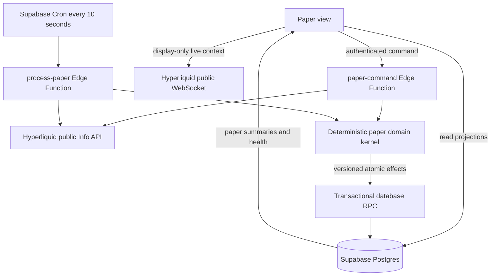
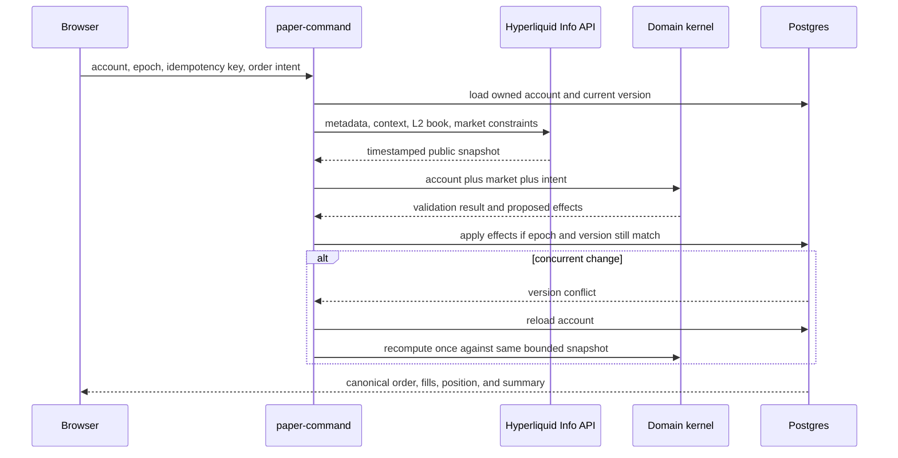
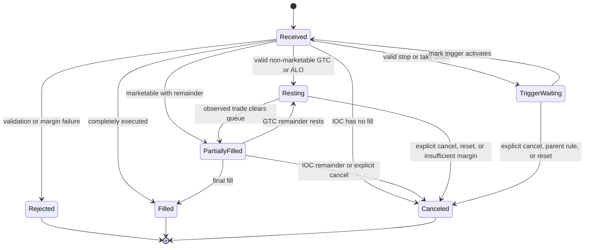
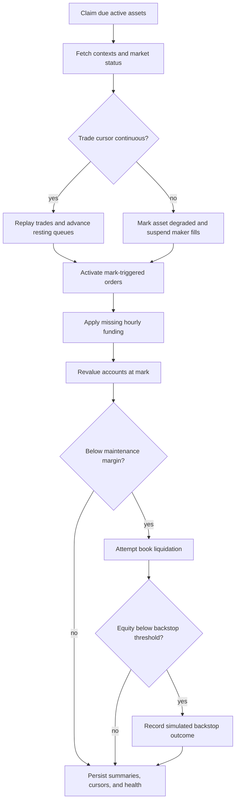

# Hyperliquid Paper Trading - Plan

## Goal Capsule

- **Objective:** Add a persistent Paper view that supports multiple independent $5,000 paper-perpetual accounts and conservatively simulates Hyperliquid trading, funding, leverage, margin, fees, and liquidation using live public market data.
- **Authority hierarchy:** This Product Contract; the confirmed conservative-fidelity boundary; current official Hyperliquid mechanics; existing Hyperdata authentication, Supabase, and minimalist UI patterns.
- **Execution profile:** Build the deterministic accounting and execution kernel test-first, then place authenticated command and scheduled processing boundaries around it, then add the Paper UI and shadow rollout.
- **Stop conditions:** Stop rather than introduce any real-order path, wallet signing, private key, or request to Hyperliquid's exchange endpoint. Stop for user direction if fidelity would require paid infrastructure, a change to the $5,000 starting balance, or inclusion of spot/portfolio-margin behavior.
- **Tail ownership:** Implementation owns migrations, Edge Functions, UI, automated tests, deployment automation, a disabled production shadow, and a reviewed PR. Enabling paper mutations follows the rollout gates in this plan.

---

## Product Contract

### Summary

The Paper tab becomes a compact, personal paper-perpetual terminal. The user can create multiple named accounts, each initialized with exactly $5,000, switch between them, place Hyperliquid-style orders, and inspect equity, margin, positions, orders, fills, funding, fees, and liquidations from any signed-in browser.

The simulator uses Hyperliquid's public metadata, marks, oracle prices, funding history, trades, and L2 books. Immediate fills mirror visible liquidity. Resting fills use a conservative queue estimate because a paper account has no actual on-chain queue position. Every result records its market-data source and fidelity classification rather than implying impossible exchange-level certainty.

### Problem Frame

The current Paper tab is empty, while the app already has public Hyperliquid market data, personal Supabase authentication, and unattended scheduled processing. A browser-only paper ledger would stop when the tab closes, race across devices, and fail to apply funding or liquidation reliably. A useful mean-reversion practice account needs durable, independently processed state and must not produce unrealistically favorable fills.

### Actor

- A1. The single allowed Hyperdata user creates and operates independent paper accounts from the shared app-level authenticated session.

### Requirements

**Accounts and persistence**

- R1. The user can create, rename, select, archive, and reset multiple independent paper accounts, each beginning with exactly 5,000.000000 USDC-equivalent equity.
- R2. Paper state persists in Supabase and is identical across signed-in browsers without a separate Paper login.
- R3. Reset creates a new $5,000 account epoch atomically, cancels open orders, closes active state, and preserves the prior epoch as read-only history.
- R4. Account history is an auditable immutable ledger whose entries reconcile to cached balances, positions, fills, funding, fees, and liquidation outcomes.

**Markets and orders**

- R5. The order ticket supports every current non-delisted Hyperliquid perpetual whose public metadata reports the USDC collateral token (`collateralToken == 0`), including HIP-3 assets such as `xyz:ORCL` and `xyz:XYZ100`; markets with a different collateral token fail closed until separate collateral ledgers exist.
- R6. The first release supports market, limit GTC, limit post-only, limit IOC, stop-market, stop-limit, take-market, take-limit, reduce-only, position TP/SL, and parent-linked TP/SL behavior.
- R7. Orders enforce current asset size precision, price precision, minimum notional, maximum order value, leverage and margin-tier limits, isolated-only constraints, market status, and open-interest restrictions when the public APIs expose them.
- R8. Marketable orders walk a fresh unaggregated L2 snapshot price by price, apply maker or taker classification, fill only displayed eligible depth, and cancel any IOC remainder that cannot be filled within the order's slippage boundary.
- R9. Resting orders use price-time priority with an estimated queue-ahead quantity and require observed public trade flow to consume that queue before receiving simulated maker fills.
- R10. Order placement and cancellation are idempotent, atomic per account, and safe under multiple browser tabs or simultaneous scheduled processing.

**Positions, margin, and accounting**

- R11. Perpetual positions net by account and asset, update entry price only when absolute exposure grows or flips, and calculate realized and unrealized P&L using Hyperliquid's published linear-contract conventions.
- R12. Each account supports integer leverage from 1x through the asset and notional tier's current maximum, cross margin, isolated margin, isolated-margin adjustment, and isolated-only assets.
- R13. Cross positions share the account's paper USDC collateral pool, while each isolated position has its own protected margin allocation.
- R14. The account summary exposes equity, cash balance, withdrawable-equivalent balance, margin used, maintenance margin, available margin, total notional, unrealized P&L, realized P&L, cumulative funding, and cumulative fees.
- R15. Fees use the current public base and rolling-volume fee schedule, each paper account's own trailing 14-day paper volume and maker fraction, and documented HIP-3 growth-mode adjustments when the required public parameters are available.
- R16. Funding is applied exactly once per asset and hourly funding timestamp using the published historical rate and oracle notional for the position held at that boundary.
- R17. Maintenance margin uses the current metadata margin table, including tier rates and maintenance deductions rather than only the headline maximum leverage.
- R18. Liquidation is triggered by mark price, first attempts book liquidation, observes Hyperliquid's large-position partial-liquidation threshold and cooldown, and records a backstop outcome when equity falls below the published backstop threshold.
- R19. Cross liquidation can consume the shared cross account, while isolated liquidation affects only that isolated position and margin allocation.

**Reliability, fidelity, and safety**

- R20. A server-side processor targets one non-overlapping run every 10 seconds without requiring an open browser and deduplicates market retrieval across accounts trading the same asset; missed buckets are surfaced as lag rather than run concurrently.
- R21. Each fill, trigger, funding payment, and liquidation records the source market timestamp, input version, processing time, and fidelity classification.
- R22. Data gaps, stale marks, missing books, exhausted API retries, or unknown risk parameters produce a visible degraded state and suspend unsupported fills rather than fabricating favorable execution.
- R23. The system monitors scheduler lag, market cursor gaps, Hyperliquid rate-limit budget, Edge invocation projection, reconciliation errors, and ledger imbalance.
- R24. The paper system never signs a wallet action, stores a private key, calls the Hyperliquid exchange endpoint, or has a path that can place a real order.

**Paper view**

- R25. The Paper view remains utilitarian: account selector and account actions, one compact order ticket, one metrics strip, positions, open orders, and a unified event history.
- R26. Desktop and mobile layouts preserve all trading information through compact tables and horizontal scrolling with the asset identity kept visible where practical.
- R27. The UI clearly labels the system `PAPER`, displays live/reconciled/degraded freshness, and distinguishes exact-book, replayed, estimated-queue, and backstop outcomes.

### Key Flows

- F1. **Create and select an account**
  - **Trigger:** A1 opens Paper while signed in and creates an account name.
  - **Steps:** The server validates ownership and name uniqueness, creates epoch one, posts the $5,000 opening ledger entry, and returns the new account summary.
  - **Outcome:** The account becomes selectable from every signed-in browser with a reconciled $5,000 balance.
- F2. **Place an immediate order**
  - **Trigger:** A1 submits a market or marketable IOC/limit order.
  - **Steps:** The command service loads metadata and a fresh L2 book, validates order and margin, walks eligible depth, applies fills and fees atomically, then recalculates margin and liquidation state.
  - **Outcome:** The user receives a deterministic accepted, partially filled, canceled, or rejected result with the exact public snapshot timestamp.
- F3. **Maintain a resting or trigger order**
  - **Trigger:** A valid non-marketable or trigger order is accepted.
  - **Steps:** Scheduled processing ingests public trades and marks, advances queue estimates, activates mark-triggered orders, applies fills, and updates child/parent order state.
  - **Outcome:** State advances without a browser and never fills through an unobserved data gap.
- F4. **Apply funding and liquidation**
  - **Trigger:** An hourly funding boundary arrives or mark-based account equity breaches maintenance margin.
  - **Steps:** The processor applies missing funding idempotently, recomputes risk, attempts liquidation against the book, and falls back to a recorded backstop outcome if required.
  - **Outcome:** The ledger and remaining account state reconcile after funding and liquidation.
- F5. **Reset an account**
  - **Trigger:** A1 confirms reset.
  - **Steps:** The server closes the active epoch under a lock, cancels orders, archives positions and summary, and creates a new epoch with a $5,000 opening entry.
  - **Outcome:** The selected account is clean while its prior history remains queryable.

### Acceptance Examples

- AE1. **Independent starting balances:** Given two newly created accounts, when either is selected, then it shows exactly $5,000 and trading in one never changes the other.
- AE2. **Visible-depth market fill:** Given an ask book with 0.5 units at 100 and 0.5 at 101, when a market buy for 0.75 is accepted, then fills are 0.5 at 100 and 0.25 at 101 with taker fees on each fill.
- AE3. **Conservative maker queue:** Given a resting bid with 10 units publicly ahead, when only 8 units trade at that price, then the paper order remains unfilled; after more than the remaining queue trades, only the eligible remainder fills as maker.
- AE4. **Hourly funding:** Given a long position held across one published positive-funding boundary, when the processor catches up twice, then the long pays funding once using boundary position size times oracle price times funding rate.
- AE5. **Cross liquidation:** Given two cross positions whose combined equity falls below combined tiered maintenance margin, when a new mark is processed, then the cross account liquidates and both positions participate in shared collateral loss.
- AE6. **Isolated protection:** Given one isolated and one cross position, when the isolated position breaches maintenance, then its liquidation does not change the cross position or cross cash ledger.
- AE7. **Data-gap restraint:** Given a gap in recent trades that overlaps a resting limit, when processing resumes, then the order receives no assumed maker fill and the UI marks its state degraded.
- AE8. **Idempotent commands:** Given the same client command is submitted from two tabs, when both requests complete, then one order and one set of ledger effects exist.
- AE9. **Mark-triggered TP/SL:** Given a long with a stop-market child, when mark crosses the trigger but last trade does not, then the stop activates once and its resulting market execution uses the next eligible live book.
- AE10. **Atomic reset:** Given an account with orders and positions, when reset succeeds, then no old-epoch mutation can affect the new $5,000 epoch and all old history remains readable.

### Success Criteria

- Every deterministic accounting fixture reconciles cash plus unrealized P&L (and isolated allocations where applicable) to account equity within 0.000001 USDC; position notional is never counted as owned asset value.
- Reprocessing any command, funding timestamp, market batch, or liquidation event produces no duplicate economic effect.
- Scheduled operation projects below 400,000 monthly Edge invocations, preserving buffer beneath the current 500,000 free-plan allowance.
- With five distinct active assets, at least 99% of scheduled production runs finish successfully and the latest canonical state normally trails wall time by no more than 20 seconds during a 24-hour shadow.
- Every simulated fill exposes its provenance and no accepted market order consumes liquidity beyond the returned L2 depth.

### Scope Boundaries

**Included now**

- Linear perpetuals whose current public metadata identifies the USDC collateral token, across Hyperliquid's validator and compatible HIP-3 perp DEXs.
- Independent paper accounts, not linked master/subaccount balances.
- Standard cross and isolated mechanics, including isolated-only asset modes.
- Common manual order types, TP/SL, fees, hourly funding, and liquidation.

**Deferred to follow-up work**

- Scale orders and TWAP scheduling.
- Strategy automation, listener-to-paper-order actions, backtesting, performance attribution, and export.
- Optional deposits, withdrawals, or manual balance adjustments after the fixed $5,000 start.
- A dedicated always-on streaming relay if free scheduled polling proves insufficient.
- Perp DEXs whose metadata identifies a non-USDC collateral token; these require independent cash, equity, and settlement ledgers before they can be simulated faithfully.

**Outside this product's identity for this release**

- Spot trading, portfolio margin, borrowing, lending, staking discounts, referral discounts, vaults, and real subaccount hierarchy.
- Real wallet connectivity, signing, exchange actions, or any custody of credentials.
- Claims of exact queue position, block-proposer ordering, validator mark construction, auto-deleveraging rank, or liquidator-vault execution that public data cannot reproduce for a nonexistent account.

### Product Contract Note

The Product Contract was created from the confirmed conversation scope. The conservative high-fidelity target is session-settled; other exclusions are planning assumptions grounded in the perps-focused request and current pre-alpha status of portfolio margin.

---

## Planning Contract

### Key Technical Decisions

| ID | Decision and rationale |
|---|---|
| KTD1 | **Use a conservative high-fidelity simulator.** (session-settled: user-approved — chosen over an immediate full-parity exchange clone: public data cannot reveal a paper order's real queue position, so the system must model uncertainty rather than invent precision.) |
| KTD2 | **Keep Supabase authoritative.** Accounts, epochs, commands, orders, positions, fills, ledger entries, funding, liquidations, risk inputs, and health state live in Postgres so multiple devices and closed browsers behave consistently. |
| KTD3 | **Use immutable economic events plus transactional projections.** The ledger, fills, funding, and liquidation records are append-only; account and position summaries are cached projections updated in the same database transaction and continuously reconciled. |
| KTD4 | **Use decimal arithmetic end to end.** Domain calculations use a pinned arbitrary-precision decimal dependency and Postgres `numeric`; JavaScript `number` is limited to timestamps and presentation. |
| KTD5 | **Process active paper markets every 10 seconds.** One scheduled `process-paper` invocation fetches each distinct active asset once and advances all relevant accounts. This projects to 259,200 scheduled invocations per 30 days, leaving room under Supabase's current free quota for existing jobs and user commands. |
| KTD6 | **Use fresh public L2 for immediate execution.** `paper-command` retrieves current metadata, context, and an unaggregated L2 snapshot before applying an immediate order. It never assumes liquidity beyond the API's returned 20 levels. |
| KTD7 | **Model resting fills conservatively.** Queue ahead starts from visible size at or ahead of placement, only observed aggressing trades reduce it, trade-through beats price-touch, and cursor gaps suspend maker fills. This intentionally biases away from optimistic paper performance. |
| KTD8 | **Replay actual funding rather than reconstruct it.** The processor reads `fundingHistory`, applies each hourly timestamp once, and uses published oracle notional. Current context funding is display/prediction data only. |
| KTD9 | **Use published mark and versioned risk inputs.** Liquidation consumes `markPx`, `oraclePx`, asset margin table, size precision, leverage limit, market mode, and fee schedule snapshots with effective timestamps. The simulator does not approximate Hyperliquid's validator mark formula. |
| KTD10 | **Limit v1 to the metadata-defined USDC collateral universe.** All supported `collateralToken == 0` cross perp positions share one paper USDC pool; isolated positions remain separate. Non-USDC collateral DEXs, spot-backed unified accounts, and portfolio margin remain outside scope rather than being normalized into a false common balance. |
| KTD11 | **Serialize mutations with account versioning.** Every command has a user-supplied idempotency key and expected account epoch/version. Database application locks the account, rejects stale epochs, and retries a recomputation rather than merging precomputed effects. |
| KTD12 | **Fetch the public fee schedule and simulate each account independently.** The current schedule can be read through `userFees` for a zero-volume address; rolling paper volume and maker fraction determine tier progression. Unsupported staking/referral benefits remain zero. |
| KTD13 | **Treat fidelity as data.** Outcomes carry `exact_book`, `trade_replay`, `estimated_queue`, `estimated_liquidation`, or `degraded` provenance plus timestamps and input versions; the UI never collapses these distinctions into a generic success label. |
| KTD14 | **Make real trading structurally impossible.** New code may call only Hyperliquid public info and websocket endpoints. No exchange endpoint constant, signing library, wallet address, private key, or action schema enters the paper modules. |

### High-Level Technical Design

#### Component topology

The Edge boundary owns external reads and authentication. The pure domain kernel accepts normalized decimal-string inputs and returns deterministic effects. Postgres owns serialization, idempotency, immutable events, and read projections.

#### Immediate order sequence

#### Order lifecycle

#### Scheduled account lifecycle

### Data Model

- `paper_accounts`: owner, name, active epoch, lifecycle state, starting equity, timestamps.
- `paper_account_epochs`: immutable reset boundary, opening and closing summary, active version, freshness and fidelity state.
- `paper_account_summaries`: cached cash, equity, margin, P&L, funding, fees, volume, and reconciliation timestamp for the active epoch.
- `paper_leverage_settings`: account, asset, margin mode, selected leverage, and isolated margin configuration.
- `paper_positions`: one net position per epoch, asset, and margin bucket with signed size, entry price, isolated allocation, cumulative economic fields, and input version.
- `paper_orders`: immutable intent plus mutable lifecycle projection, remaining size, trigger/limit fields, TIF, reduce-only, parent/child relationship, queue estimate, status, and idempotency key.
- `paper_fills`: append-only maker/taker and liquidation executions with size, price, fee, source timestamp, book/trade identifier, and fidelity.
- `paper_ledger_entries`: append-only cash effects for opening balance, realized P&L, fee, funding, isolated transfer, liquidation, and reset close.
- `paper_funding_payments`: one row per epoch, asset, and published funding timestamp.
- `paper_liquidations`: trigger snapshot, maintenance calculation, attempted book fills, partial/backstop classification, cooldown, and remaining equity.
- `paper_market_inputs`: versioned metadata, fee schedule, mark/oracle context, L2 timestamp, recent-trade cursor, gap state, and retention metadata.
- `paper_processor_runs`: scheduler state, assets/accounts processed, lag, API weight estimate, invocation projection, errors, and reconciliation failures.

All economic columns use `numeric`, all external decimals enter as strings, and all active-row mutations include epoch and version predicates.

### Market Processing and Fidelity Rules

1. Active assets are the distinct union of open positions, open/trigger orders, and assets requested by an in-flight command.
2. Positions receive highest scheduling priority, then trigger orders, then resting orders. A rate-budget shortfall degrades lower-priority assets rather than delaying liquidation checks silently.
3. Immediate taker execution walks eligible book levels in price order and records one fill per level. A book older than the freshness ceiling is discarded and fetched once more before rejecting.
4. A new resting order snapshots visible queue at its price and all better prices. Later public trades reduce the modeled queue only when their aggressing side and price are relevant.
5. Mark price triggers TP/SL and liquidation. Public trades drive maker queue consumption. Oracle price drives funding notional. Mid price is display and trigger-validation context only.
6. When a recent-trade cursor cannot be continued, no maker fill is inferred for the missing interval. Existing positions are still revalued from a fresh published mark, and the gap remains visible until continuity is re-established.
7. Current metadata and fee schedules are cached with effective timestamps, refreshed on a bounded cadence, and force-refreshed after a constraint-related rejection or unknown asset.
8. Per-DEX contexts are fetched once per 10-second target bucket. Recent trades are fetched only for assets with resting orders, funding history only for hourly catch-up, and L2 only for immediate, newly triggered, or liquidation execution. The processor records actual request weight and stops lower-priority work before its configured budget.
9. A resting order's initial-margin sufficiency is rechecked against canonical account state immediately before every simulated fill. If it no longer passes, the fill is not applied and the order is canceled with an explicit match-time margin reason.
10. Closed, paused, stale, or otherwise non-tradable markets continue to revalue from a valid fresh mark where available, but suspend new executions and triggers that require a book. The UI exposes the market state and input age.
11. Market events are ordered by source timestamp, then deterministic event priority and stable source identifier. At an hourly boundary, funding applies to the signed position reconstructed from immutable fills immediately before that boundary—not merely the latest position projection—so delayed processing and fills with later timestamps cannot alter it; equal-timestamp fixtures use the documented priority consistently.

### Margin and Liquidation Rules

- Opening exposure requires notional divided by selected leverage plus fees to fit available initial margin after existing orders and positions.
- Maintenance margin follows the active tier's notional times maintenance rate minus maintenance deduction; the maintenance rate is half the initial-margin rate at that tier's maximum leverage.
- Cross risk uses account cross equity and the sum of cross maintenance requirements. Isolated risk uses only isolated margin, isolated unrealized P&L, and that position's maintenance requirement.
- Liquidation uses current mark for eligibility, then a current L2 book for attempted execution. Positions above Hyperliquid's published large-position threshold follow the 20% partial attempt and cooldown behavior.
- When liquidation begins, all affected open orders are canceled atomically, their reserved initial margin is released, and account risk is recomputed before the liquidation size is chosen. No order on the affected margin pool can fill during liquidation.
- If simulated equity falls below two-thirds of required maintenance after eligible book attempts, cross backstop closes the cross pool to zero residual equity and isolated backstop consumes only that isolated allocation. The record is labeled `estimated_liquidation` because the paper account cannot enter the real liquidator vault.

### Assumptions

- Each paper account models a separate wallet-level account with an independent fee tier, not Hyperliquid subaccounts that share a master fee tier.
- The first release admits only assets whose current metadata reports `collateralToken == 0`; discovery re-evaluates that property on metadata refresh and never migrates a live position silently if it changes.
- The 10-second processor is the maximum default cadence that preserves reasonable free-tier headroom alongside existing scheduled functions; it is not exchange-tick fidelity.
- Hyperliquid public endpoints continue to expose margin tables, asset contexts, L2 books, recent trades, fee schedules, and funding history without authentication.
- Parent-linked TP/SL implements documented activation and cancellation behavior, while Scale and TWAP remain deferred.

### System-Wide Impact

- **Authentication and RLS:** Existing app-level magic-link authentication remains the only login. Paper reads are owner-scoped, while economic mutations go through authenticated Edge Functions and narrowly granted transactional RPCs.
- **Market API load:** Paper processing adds high-frequency public reads. Requests must be deduplicated by asset, account-independent, retry-bounded, and measured against Hyperliquid's 1,200-weight-per-minute IP budget.
- **Supabase usage:** A 10-second scheduled function adds about 259,200 invocations per 30-day month. Existing scheduled functions and user commands require an operational ceiling and alert before the 500,000 free quota is threatened.
- **Storage:** Immutable ledger and input provenance increase row count. Raw L2 books are not retained indefinitely; only fill-relevant levels, input hashes, and short diagnostic windows are stored.
- **UI:** `public/app.js` should delegate Paper behavior to a focused module rather than absorbing another large feature controller.
- **Deployment:** The Supabase workflow must deploy two additional functions and configure the paper scheduler and feature flag without changing alert delivery state.

### Risks and Mitigations

| Risk | Mitigation |
|---|---|
| Queue position is unknowable | Use visible queue-ahead plus observed trade depletion, label estimated fills, and never use touch-only fills. |
| Ten-second marks can miss intrainterval liquidation | Record the cadence limitation, prioritize active positions, optionally ingest browser live marks as display-only evidence, and evaluate whether a streaming relay is required after shadow comparison. |
| `recentTrades` can gap during high volume | Persist cursors, detect discontinuity, suspend maker fills across the gap, and expose degraded fidelity. |
| L2 snapshots expose only 20 levels per side | Fill only returned depth; cancel or reject the remainder instead of extrapolating liquidity. |
| Metadata, margin tables, or fee schedules change | Version every external rule input, refresh automatically, and retain the applied version on every economic event. |
| Multiple accounts or tabs race | Use account locks, epochs, optimistic versions, and command idempotency keys. |
| Decimal drift corrupts reconciliation | Use arbitrary-precision decimal math, Postgres `numeric`, golden accounting vectors, and continuous ledger reconciliation. |
| Free-tier or Hyperliquid limits are exceeded | Track invocation and API-weight projections, deduplicate active assets, prioritize risk checks, and degrade safely before quota exhaustion. |
| The UI suggests real-trading certainty | Keep persistent PAPER labeling and per-event fidelity/provenance visible. |
| New modules accidentally gain a real-order path | Test and review for an allowlist of public Info/WebSocket origins and prohibit signing/exchange dependencies. |
| A HIP-3 DEX settles in a different collateral token | Exclude it through metadata-driven admission in v1; add it only with a separately specified collateral ledger, valuation, and liquidation model. |
| A scheduled run overlaps the next 10-second bucket | Acquire one lease with a runtime ceiling, let the later invocation record overlap/lag and exit, and make every event independently idempotent. |

### Phased Delivery

1. Land schema and deterministic domain mechanics without exposing Paper mutations.
2. Add authenticated commands and scheduled processing behind `PAPER_TRADING_ENABLED=false`.
3. Run fixture, clean-database, concurrency, and public-API contract tests.
4. Deploy production shadow processing against synthetic accounts with no user-visible mutation controls.
5. Compare immediate fills, funding, margin, and liquidation fixtures against official examples and captured public market inputs.
6. Enable the Paper view after a 24-hour processor and quota gate; keep all real-trading surfaces structurally absent.

### Sources and Research

- Existing application patterns: `public/app.js`, `public/lib/hyperliquid.js`, `public/lib/supabase.js`, `supabase/functions/monitor-market/`, and `supabase/migrations/202607180002_listener_foundation.sql`.
- [Hyperliquid margining](https://hyperliquid.gitbook.io/hyperliquid-docs/trading/margining) for cross/isolated initial and maintenance margin.
- [Hyperliquid margin tiers](https://hyperliquid.gitbook.io/hyperliquid-docs/trading/margin-tiers) for tiered maintenance rates and deductions.
- [Hyperliquid liquidations](https://hyperliquid.gitbook.io/hyperliquid-docs/trading/liquidations) for mark eligibility, partial liquidation, cooldown, and backstop behavior.
- [Hyperliquid funding](https://hyperliquid.gitbook.io/hyperliquid-docs/trading/funding) for hourly settlement and oracle-notional payment.
- [Hyperliquid order types](https://hyperliquid.gitbook.io/hyperliquid-docs/trading/order-types) and [TP/SL behavior](https://hyperliquid.gitbook.io/hyperliquid-docs/trading/take-profit-and-stop-loss-orders-tp-sl) for order lifecycle.
- [Hyperliquid order book](https://hyperliquid.gitbook.io/hyperliquid-docs/hypercore/order-book) for price-time priority and match-time margin checks.
- [Hyperliquid entry price and P&L](https://hyperliquid.gitbook.io/hyperliquid-docs/trading/entry-price-and-pnl) for position accounting.
- [Hyperliquid tick and lot size](https://hyperliquid.gitbook.io/hyperliquid-docs/for-developers/api/tick-and-lot-size) and [error responses](https://hyperliquid.gitbook.io/hyperliquid-docs/for-developers/api/error-responses) for input validation and rejection parity.
- [Hyperliquid perpetual info endpoints](https://hyperliquid.gitbook.io/hyperliquid-docs/for-developers/api/info-endpoint/perpetuals) and [WebSocket subscriptions](https://hyperliquid.gitbook.io/hyperliquid-docs/for-developers/api/websocket/subscriptions) for metadata, contexts, books, funding, and public trades.
- [Hyperliquid API limits](https://hyperliquid.gitbook.io/hyperliquid-docs/for-developers/api/rate-limits-and-user-limits) for request budgeting.
- [Supabase Cron](https://supabase.com/docs/guides/cron), [Edge Function limits](https://supabase.com/docs/guides/functions/limits), and [Edge Function pricing](https://supabase.com/docs/guides/functions/pricing) for the 10-second free-tier processing boundary.

---

## Implementation Units

### U1. Paper persistence and authorization foundation

- **Goal:** Create the multi-account, epoch, order, position, economic-event, market-input, and processor-health schema with owner-only reads and transactional mutation primitives.
- **Requirements:** R1-R4, R10, R21-R24; F1, F5; AE1, AE8, AE10; KTD2-KTD4, KTD11, KTD14.
- **Dependencies:** None.
- **Files:** `supabase/migrations/202607190001_paper_foundation.sql`, `supabase/migrations/202607190002_paper_operations.sql`, `supabase/tests/paper_foundation_test.sql`, `supabase/tests/paper_rls_test.sql`, `supabase/tests/paper_concurrency_test.sql`.
- **Approach:** Add the tables in the Data Model, active-epoch uniqueness, idempotency constraints, numeric invariants, lifecycle checks, owner RLS, read grants, and service-only effect application. Expose owner-authenticated account create/rename/archive/reset operations through narrow functions. Keep all economic writes inaccessible to direct browser table mutation.
- **Execution note:** Start with failing pgTAP tests for ownership, epoch isolation, idempotency, and transaction rollback before adding mutation functions.
- **Patterns to follow:** Owner email and user checks from `supabase/migrations/202607180002_listener_foundation.sql`; explicit grants from `supabase/migrations/202607180008_explicit_api_privileges.sql`; claim/lock semantics from `supabase/migrations/202607180004_listener_operations.sql`.
- **Test scenarios:**
  1. Covers F1 / AE1. Create two accounts for the allowed user and verify independent $5,000 opening ledgers and summaries.
  2. Reject a duplicate case-insensitive active account name without changing either account.
  3. Covers AE8. Apply the same command idempotency key twice and verify one order, one effect set, and the same canonical response reference.
  4. Submit effects against a stale account version and verify the full transaction rolls back.
  5. Covers F5 / AE10. Reset an active account and verify old orders cannot mutate the new epoch while old history remains readable.
  6. Verify anonymous, wrong-email, and different-user roles cannot read or mutate paper state.
  7. Verify the authenticated owner can read projections but cannot directly insert a fill, ledger entry, funding payment, or liquidation.
- **Verification:** A clean database reset applies all migrations, pgTAP proves RLS and concurrency boundaries, and every cached summary reconciles to its opening and economic ledger entries.

### U2. Deterministic decimal accounting and risk kernel

- **Goal:** Implement pure, arbitrary-precision position, P&L, fee, funding, margin, and liquidation calculations independent of HTTP and database clients.
- **Requirements:** R11-R19, R21-R22; F4; AE2, AE4-AE6; KTD4, KTD8-KTD10, KTD12-KTD13.
- **Dependencies:** None.
- **Files:** `supabase/functions/_shared/paper/decimal.ts`, `supabase/functions/_shared/paper/types.ts`, `supabase/functions/_shared/paper/accounting.ts`, `supabase/functions/_shared/paper/fees.ts`, `supabase/functions/_shared/paper/margin.ts`, `supabase/functions/_shared/paper/liquidation.ts`, `supabase/functions/tests/paper/accounting.test.ts`, `supabase/functions/tests/paper/fees.test.ts`, `supabase/functions/tests/paper/margin.test.ts`, `supabase/functions/tests/paper/liquidation.test.ts`, `supabase/functions/deno.json`, `supabase/functions/deno.lock`.
- **Approach:** Normalize external decimals into a pinned decimal type. Return proposed immutable effects and projections without side effects. Encode entry-price behavior for adds, reductions, closures, and flips; rolling fee-tier selection; hourly funding sign and oracle notional; tiered initial and maintenance margin; cross and isolated equity; partial and backstop liquidation decisions.
- **Execution note:** Implement official formulas and numerical examples as golden tests before writing generalized transitions.
- **Patterns to follow:** Pure detector/statistics modules and Deno tests under `supabase/functions/_shared/` and `supabase/functions/tests/`.
- **Test scenarios:**
  1. Add to a long, partially reduce it, fully close it, and flip short; verify entry price, realized P&L, and fees at each transition.
  2. Run equivalent short transitions and verify signs and account-equity conservation.
  3. Covers AE2. Apply multi-level fills and verify weighted entry, per-fill fees, cash, and equity to six decimal places.
  4. Cross the published rolling-volume and maker-fraction tier boundaries and verify the exact new rate begins at the correct boundary.
  5. Covers AE4. Apply positive and negative funding to long and short positions using oracle notional, then replay the same boundary and verify the kernel exposes an idempotent no-op.
  6. Evaluate maintenance immediately below, at, and above each margin-tier boundary and verify continuous deduction behavior.
  7. Covers AE5. Combine profitable and losing cross positions and verify shared equity triggers only when total maintenance is breached.
  8. Covers AE6. Liquidate an isolated position and verify cross cash and other isolated allocations remain unchanged.
  9. Evaluate the 100,000 USDC partial-liquidation threshold, 20% liquidation size, 30-second cooldown, and two-thirds backstop boundary.
  10. Feed extreme decimal sizes and prices within contract precision and verify no IEEE-754 drift or negative-zero output.
- **Verification:** Pure Edge tests cover every state transition, all golden vectors reconcile within 0.000001 USDC, and the kernel imports no database, network, signing, or browser dependency.

### U3. Versioned Hyperliquid paper-market adapter

- **Goal:** Supply normalized, timestamped, rate-budgeted public metadata, marks, oracle prices, books, trades, funding, fee schedules, and market restrictions to the paper engine.
- **Requirements:** R5, R7-R9, R15-R18, R21-R24; AE3, AE7, AE9; KTD6-KTD9, KTD12-KTD14.
- **Dependencies:** U2 types and decimal boundary.
- **Files:** `supabase/functions/_shared/hyperliquid.ts`, `supabase/functions/_shared/paper/market-data.ts`, `supabase/functions/_shared/paper/constraints.ts`, `supabase/functions/tests/shared/hyperliquid.test.ts`, `supabase/functions/tests/paper/market-data.test.ts`, `supabase/functions/tests/paper/constraints.test.ts`.
- **Approach:** Extend the existing retrying public Info client with all-perp metadata, collateral-token admission, margin tables, unaggregated L2 books, recent trades, funding history, zero-volume fee schedule, market status, and open-interest-cap queries. Preserve source timestamps and hashes, estimate request weights, validate asset/DEX routing, and detect trade cursor discontinuity. Maintain an explicit allowlist that excludes the exchange endpoint.
- **Patterns to follow:** DEX batching, HIP-3 normalization, retry jitter, timeout, and partial-isolation behavior in `supabase/functions/_shared/hyperliquid.ts`.
- **Test scenarios:**
  1. Normalize validator and HIP-3 assets with collateral token, size precision, leverage, margin table, isolated mode, growth mode, and context prices intact; admit token `0` and fail closed for other collateral tokens.
  2. Parse multi-tier margin tables and reject an asset referencing a missing table.
  3. Preserve all returned L2 levels and timestamps without aggregation or numeric coercion.
  4. Continue a recent-trade cursor across overlapping responses without duplicates and flag a response that cannot connect to the stored cursor.
  5. Paginate funding history and return each boundary once in chronological order.
  6. Parse the public base/VIP/MM fee schedule and retain an effective input version.
  7. Calculate request weights and stop lower-priority retrieval before exceeding the configured per-minute budget.
  8. Exhaust 429 retries for one asset without discarding other DEX or asset results.
  9. Reject any configured origin or path outside the public Info and WebSocket allowlist.
  10. Treat a closed, paused, or stale stock-perp market as non-executable while preserving valid risk revaluation inputs.
- **Verification:** Contract fixtures captured from current public responses remain stable, malformed or missing fields fail closed, and adapter tests prove no exchange action can be emitted.

### U4. Account commands and immediate order execution

- **Goal:** Provide authenticated account actions, leverage/margin changes, order placement, and cancellation with fresh market validation and atomic canonical results.
- **Requirements:** R1-R3, R5-R14, R20-R24; F1, F2, F5; AE1, AE2, AE8-AE10; KTD2-KTD7, KTD9-KTD14.
- **Dependencies:** U1-U3.
- **Files:** `supabase/functions/paper-command/index.ts`, `supabase/functions/paper-command/handler.ts`, `supabase/functions/_shared/paper/execution.ts`, `supabase/functions/tests/paper-command/handler.test.ts`, `supabase/functions/tests/paper/execution.test.ts`, `supabase/config.toml`.
- **Approach:** Authenticate the existing Supabase session and allowed email, validate a versioned command schema, load one owned epoch, retrieve only required public market inputs, run the pure kernel, and apply effects through the transactional RPC. Market and marketable orders walk the live book. Non-marketable and trigger orders persist queue/trigger state. Retry one version conflict by reloading and recomputing against a still-fresh snapshot.
- **Execution note:** Start with request-to-ledger integration tests for a market fill, a resting order, and duplicate command submission.
- **Patterns to follow:** Runtime config and service client modules under `supabase/functions/_shared/`; authenticated owner rules from the Alerts UI and migrations.
- **Test scenarios:**
  1. Covers F2 / AE2. Submit a valid market buy and verify multi-level fills, taker fees, position, ledger, and canonical summary in one transaction.
  2. Submit a market order larger than visible eligible depth and verify a partial fill plus canceled remainder, never extrapolated depth.
  3. Submit valid GTC, ALO, and IOC limits on both sides and verify crossing ALO rejects, empty IOC cancels, and GTC rests.
  4. Submit invalid size precision, price precision, sub-$10 notional, excessive leverage, insufficient margin, isolated-only cross mode, and open-interest-cap increase; verify no state changes.
  5. Submit reduce-only orders that reduce, close, exceed, or reverse exposure; cap or reject according to the documented behavior without increasing exposure.
  6. Create stop/take market and limit orders on valid and invalid trigger sides; verify only valid triggers persist.
  7. Covers AE9. Create parent-linked TP/SL and verify documented child activation and cancellation behavior after full fill, user-canceled partial fill, and margin-canceled partial fill.
  8. Covers AE8. Race two commands against one account version and verify serialized canonical outcomes with no lost update.
  9. Attempt a command as anonymous, wrong-email, different-user, archived-account, and stale-epoch callers; verify authorization failure and no public market request where ownership fails first.
  10. Covers F5 / AE10. Reset while a scheduled mutation is pending and verify epoch fencing prevents contamination.
  11. Reject a supported-looking asset whose refreshed metadata reports a nonzero collateral token without altering account state.
- **Verification:** Authenticated integration tests cover command through database effects, command latency and market snapshot age are recorded, and code search finds no signing or exchange endpoint surface.

### U5. Resting-order, funding, and liquidation processor

- **Goal:** Advance open paper accounts every 10 seconds without a browser, using deduplicated public inputs and safe degradation.
- **Requirements:** R8-R10, R15-R23; F3, F4; AE3-AE7, AE9; KTD2-KTD9, KTD11-KTD13.
- **Dependencies:** U1-U4.
- **Files:** `supabase/functions/process-paper/index.ts`, `supabase/functions/process-paper/processor.ts`, `supabase/functions/_shared/paper/queue.ts`, `supabase/functions/_shared/paper/reconciliation.ts`, `supabase/functions/tests/process-paper/processor.test.ts`, `supabase/functions/tests/paper/queue.test.ts`, `supabase/functions/tests/paper/reconciliation.test.ts`, `supabase/migrations/202607190003_paper_scheduler.sql`, `scripts/configure-supabase-runtime.mjs`.
- **Approach:** Require a server-held scheduler credential before any read or mutation, then acquire one expiring processor lease, claim one time bucket, load active distinct assets, prioritize risk-bearing positions, fetch inputs once per asset, and process accounts under version checks. Replay continuous public trades into queue estimates, activate mark triggers, reconstruct boundary exposure from immutable fills, fetch and apply missing funding in deterministic source-time order, revalue risk, perform book liquidation, reconcile ledgers, and persist processor health. Schedule at `10 seconds` only while the feature is enabled; anonymous or user-session calls reject, and overlapping invocations record lag and exit instead of processing concurrently.
- **Execution note:** Build deterministic batch fixtures that can be replayed twice before connecting the scheduler.
- **Patterns to follow:** Bucket claims, run health, retries, and cron configuration in `monitor-market`; durable idempotency from funding and outbox tables.
- **Test scenarios:**
  1. Covers F3 / AE3. Replay trade batches below and beyond queue ahead and verify conservative partial maker fills.
  2. Covers AE7. Introduce a cursor gap and verify maker fills suspend, the asset becomes degraded, and later continuous data does not retroactively invent fills.
  3. Process multiple accounts on one asset and verify one external market fetch advances independent account states.
  4. Covers AE9. Cross stop and take triggers using mark price, then execute activated orders against the next eligible book exactly once.
  5. Covers F4 / AE4. Catch up multiple missed hourly funding rows chronologically and verify each applies once to boundary exposure.
  6. Covers AE5. Trigger cross liquidation, walk available book depth, enforce partial-liquidation cooldown, and backstop only when the post-attempt threshold remains breached.
  7. Covers AE6. Trigger isolated liquidation and verify unrelated margin buckets remain untouched.
  8. Retry a partially failed asset batch and verify successful assets are not duplicated.
  9. Exceed the projected API-weight or invocation guard and verify lower-priority resting-only assets degrade before position risk checks.
  10. Reconcile a deliberately corrupted cached summary, record a processor failure, and refuse further economic mutation until repaired.
  11. Reach a resting order after its account margin changed and verify match-time margin failure cancels it without a fill.
  12. Place fills immediately before, exactly at, and immediately after an hourly boundary and verify funding uses the position selected by the documented timestamp/priority rule exactly once.
  13. Begin liquidation with open orders, atomically cancel them and release reservations, then verify liquidation size uses recomputed risk and no canceled order can race a fill.
  14. Start overlapping scheduled invocations and verify only the lease holder mutates state while the other records overlap/lag and exits successfully.
  15. Call the processor anonymously, with an ordinary user JWT, and with an invalid scheduler credential; verify each request fails before reading paper state or Hyperliquid data.
- **Verification:** Replaying the same scheduled bucket is a no-op, processor tests pass with no network, cron health exposes lag and quotas, and a clean local scheduler run advances seeded accounts predictably.

### U6. Minimal Paper view and live projection

- **Goal:** Turn the empty Paper tab into a compact account/order/position utility backed by canonical Supabase state and display-only live market context.
- **Requirements:** R1-R3, R5-R6, R12-R14, R25-R27; F1-F5; AE1-AE10; KTD1-KTD2, KTD10, KTD13-KTD14.
- **Dependencies:** U1, U4, U5.
- **Files:** `public/index.html`, `public/styles.css`, `public/app.js`, `public/paper.js`, `public/lib/paper.js`, `public/lib/hyperliquid.js`, `test/paper.test.js`, `package.json`.
- **Approach:** Keep global auth and tabs unchanged. Add an account selector and compact account actions, metric strip, order ticket, positions table, open-orders table, and event history. Use the existing market catalog and websocket for responsive display only; all submitted decisions and canonical balances come from `paper-command` and Supabase. Refresh canonical state after commands and on a bounded interval, with clear live/reconciled/degraded status.
- **Patterns to follow:** Existing minimalist tab, table, number formatting, mobile sticky-asset, and account-auth patterns in `public/index.html`, `public/styles.css`, and `public/app.js`.
- **Test scenarios:**
  1. Normalize and validate account names, order fields, leverage, margin mode, TIF, trigger direction, and reduce-only intent before submission.
  2. Render long, short, flat, isolated, cross, liquidated, and degraded states with correct signs and fixed decimal precision.
  3. Change accounts and verify every metric, order, position, and history row switches together without stale data from the prior account.
  4. Hide or disable mutation controls while signed out, archived, loading, command-pending, or feature-disabled.
  5. Preserve selected values after a rejected order while displaying the canonical rejection reason.
  6. Render exact-book, replayed, estimated-queue, estimated-liquidation, and degraded provenance distinctly without adding decorative UI.
  7. On mobile, horizontally scroll wide tables while keeping the asset identity readable and all order controls operable.
  8. Confirm websocket loss changes only display freshness and never mutates canonical positions or fills.
- **Verification:** Node tests cover pure Paper view helpers, syntax checks include new modules, and signed-in desktop/mobile browser smoke tests complete every key flow without console or accessibility errors.

### U7. Deployment, observability, and retention

- **Goal:** Deploy the paper engine safely, monitor free-tier and market-data budgets, and bound storage growth without coupling it to alert delivery.
- **Requirements:** R20-R24, R27; KTD5, KTD9, KTD13-KTD14.
- **Dependencies:** U1-U6.
- **Files:** `.github/workflows/deploy-supabase.yml`, `supabase/config.toml`, `scripts/configure-supabase-runtime.mjs`, `supabase/migrations/202607190004_paper_retention.sql`, `supabase/tests/paper_retention_test.sql`, `README.md`.
- **Approach:** Deploy `paper-command` and `process-paper`, configure separate `PAPER_TRADING_ENABLED` and scheduler-auth secrets and the 10-second cron, retain economic history while pruning raw market diagnostics and processor detail, and expose SQL health checks. Keep `DELIVERY_ENABLED` independent. Document secret rotation, fidelity limits, usage projections, recovery, and scheduler disablement.
- **Patterns to follow:** Existing Supabase deploy workflow, secret configuration, scheduler setup, and listener retention/health documentation.
- **Test scenarios:**
  1. With the feature flag false, command mutations reject and scheduled processing exits without touching account state.
  2. Reconfiguring cron is idempotent and leaves exactly one paper processor job at the intended cadence.
  3. Retention removes expired raw inputs and run details but never economic ledger, fills, funding, liquidations, account epochs, or applied input versions.
  4. A projected invocation total above the warning ceiling appears in processor health before quota exhaustion.
  5. Paper deployment does not alter the alert-delivery variable, alert cron jobs, or existing listener functions.
- **Verification:** Clean deployment applies all migrations and functions, disabled-mode production smoke creates no economic effects, health queries report cadence and projected usage, and rollback consists of disabling the paper flag/cron without deleting history.

### U8. Fidelity shadow and activation gate

- **Goal:** Prove accounting correctness, market-input continuity, quota safety, and UI behavior before allowing the personal account to create paper trades.
- **Requirements:** R4, R8-R10, R15-R24, R27; all acceptance examples; KTD1, KTD3, KTD5-KTD9, KTD13-KTD14.
- **Dependencies:** U1-U7.
- **Files:** `supabase/functions/tests/fixtures/paper/`, `supabase/tests/paper_end_to_end_test.sql`, `docs/plans/2026-07-19-001-feat-hyperliquid-paper-trading-plan.md`, `README.md`.
- **Approach:** Capture sanitized public metadata/book/trade/funding fixtures for validator and HIP-3 markets, replay deterministic scenarios, then run the production processor for 24 hours with synthetic non-user-visible accounts and mutations disabled in the UI. Compare processor marks, funding boundaries, order constraints, accounting, scheduler lag, API weight, and invocation projections against sources.
- **Execution note:** Do not activate because time elapsed; require evidence for every gate.
- **Patterns to follow:** The listener's shadow deployment, monitor health evidence, controlled cutover, and delivery-disabled rollout.
- **Test scenarios:**
  1. Replay all acceptance examples from a clean database and verify ledger reconciliation after every economic transition.
  2. Replay the same fixture set twice and verify byte-equivalent economic rows and no duplicate effects.
  3. Run validator BTC and HIP-3 ORCL metadata/order fixtures through identical engine paths with their distinct precision, leverage, and DEX routing, then verify a non-USDC-collateral fixture is rejected before account mutation.
  4. Compare published funding history with applied synthetic positions across multiple boundaries.
  5. Inject stale books, missing contexts, rate limits, cursor gaps, scheduler delay, and concurrent account commands; verify safe degradation and recovery.
  6. Run a signed-in browser flow for account creation, immediate order, resting order, funding display, cancellation, reset, and cross-device refresh.
- **Verification:** All automated suites pass; 24-hour shadow shows no duplicate effects, reconciliation failures, hidden gaps, or quota breach; and activation requires an explicit reviewed change from false to true.

---

## Verification Contract

| Gate | Command or evidence | Units | Required outcome |
|---|---|---|---|
| Browser-library tests | `npm test` | U6 | Paper validation, formatting, and state helpers pass alongside existing watchlist/alert tests. |
| JavaScript syntax | `npm run check` | U6-U7 | Every new public and deployment module is included and parses. |
| Edge domain and integration tests | `npm run test:edge` | U2-U5, U8 | Accounting, execution, adapter, commands, processor, funding, and liquidation tests pass with deterministic fixtures. |
| Database behavior | `npm run test:db` | U1, U3-U5, U7-U8 | RLS, constraints, idempotency, concurrency, reset, retention, and end-to-end pgTAP scenarios pass. |
| Clean migration proof | `supabase db reset` followed by the database suite | U1, U7 | A pristine Postgres 17 instance applies every migration and passes without inherited privileges. |
| Local function smoke | Local Supabase plus `paper-command` and `process-paper` fixture requests | U4-U5 | Auth, service boundaries, one command, one scheduled batch, and canonical reads operate end to end. |
| Browser acceptance | Signed-in desktop and narrow-mobile runs against local Supabase | U6, U8 | F1-F5 work with no console errors, stale-account bleed, inaccessible controls, or misleading live status. |
| Safety audit | Source scan and dependency review | U3-U8 | No exchange endpoint, wallet signing, private key, or real-order action is present. |
| Production shadow | 24 hours with user mutation controls disabled | U7-U8 | At least 99% successful scheduled runs, ordinary lag at or below 20 seconds, zero duplicate effects, zero ledger imbalance, continuous active-asset cursors or visible degradation, and projected monthly invocations below 400,000. |

---

## Definition of Done

- The Paper tab supports multiple persistent named accounts with exactly $5,000 per new/reset epoch.
- Market, limit GTC/ALO/IOC, stop/take market and limit, reduce-only, and documented TP/SL parent/position flows work across validator and supported USDC-collateral HIP-3 perps.
- Positions, P&L, fees, funding, cross/isolated margin, tiered maintenance, partial liquidation, and backstop outcomes reconcile through immutable economic events.
- Immediate fills consume only fresh visible L2 depth; resting fills require conservative observed queue depletion; all uncertainty is labeled.
- Canonical processing continues every 10 seconds without an open browser and safely degrades on stale or discontinuous input.
- RLS, owner authentication, account epoch fencing, command idempotency, and transactional projection updates prevent cross-account or cross-device corruption.
- Operational health reports scheduler lag, cursor continuity, API weight, invocation projection, reconciliation, and input versions.
- The feature remains structurally incapable of placing a real Hyperliquid order or handling a private key.
- Automated Node, Deno, pgTAP, clean-reset, integration, and browser acceptance gates pass.
- The production feature flag stays false until the 24-hour shadow satisfies every activation criterion.
- Documentation explains supported mechanics, fidelity labels, known exclusions, quota posture, rollback, and recovery.
- Experimental code, dead-end schema objects, stale fixtures, and abandoned implementation paths are removed before merge.
