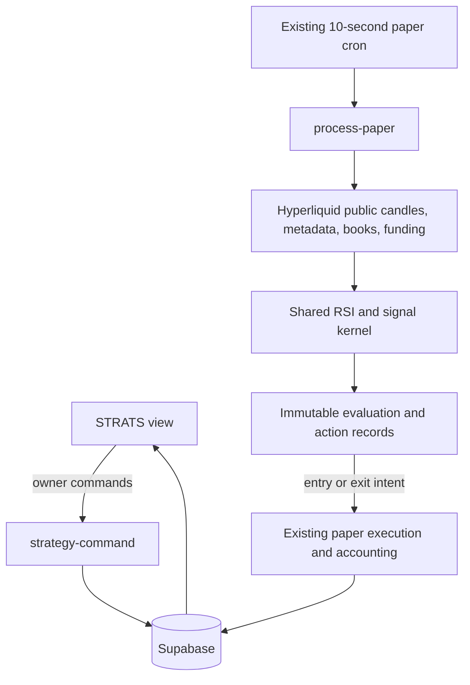
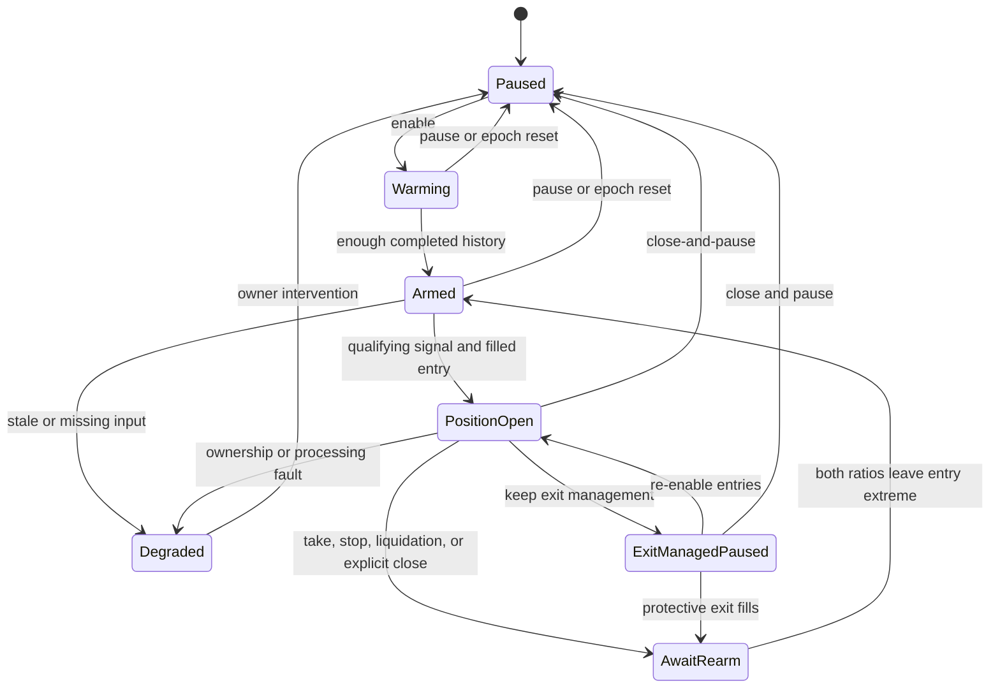
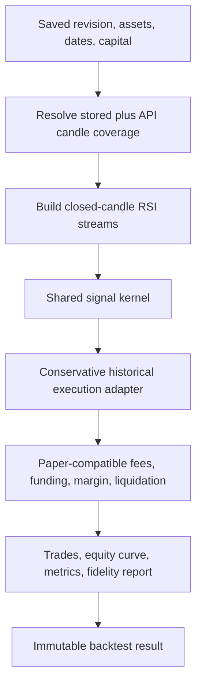

# Automated Strategies and Backtesting - Plan

## Goal Capsule

- **Objective:** Add a barebones STRATS view where the owner can define automated paper strategies, assign them to paper-account assets, run auditable backtests, and inspect live decisions and results.
- **Authority hierarchy:** This plan; the existing paper-trading Product Contract in `docs/plans/2026-07-19-001-feat-hyperliquid-paper-trading-plan.md`; the user's stated RSI strategy; current Hyperliquid public-data contracts; existing Supabase ownership and scheduler boundaries.
- **Execution profile:** Build deterministic indicator, signal, and backtest kernels first; add owner-scoped persistence; integrate live execution into the existing paper processor; add the minimal STRATS UI last; enable live assignments only after a shadow run.
- **Stop conditions:** Stop rather than place real Hyperliquid orders, imply tick-accurate historical execution from candle data, allow two controllers to own the same paper position, evaluate incomplete candles, or enable an assignment whose inputs are stale or under-warmed.
- **Tail ownership:** Implementation includes schema, shared strategy code, Edge endpoints, paper-engine integration, UI, automated tests, deployment, initial DRAM/XYZ100/BTC backtests, and a disabled-by-default production shadow.

---

## Product Contract

### Summary

The STRATS view will manage reusable strategy definitions, paper-account assignments, live status, and backtests. The first definition is a dual-timeframe relative-RSI mean-reversion strategy with literal, inspectable formulas and max-allowed leverage.

### Problem Frame

Hyperdata can already run paper accounts without an open browser, but it has no durable concept of a strategy, signal, strategy-owned position, or historical simulation. Adding automation directly to browser code would stop when the browser closes, duplicate actions across tabs, and produce results that cannot be reproduced. Adding it as an untracked paper-order caller would also make manual and automated position ownership ambiguous.

The first strategy contains two underspecified terms: “average RSI” and “10% loss / 20% gain after leverage.” This plan makes both definitions explicit and configurable so the first results are reproducible and later statistical revisions do not require a schema rewrite.

### Actor

- A1. The single allowed Hyperdata owner creates strategies, assigns them to active paper-account epochs, runs backtests, and enables or pauses paper automation.

### Requirements

**Strategy definition and assignment**

- R1. Add a top-level `STRATS` route and minimal view for definitions, assignments, live status, signals, and backtest results.
- R2. A strategy definition is versioned and reusable across assets and accounts; editing creates a new immutable revision rather than changing the meaning of prior signals or backtests.
- R3. An assignment binds one strategy revision, one asset, and one active paper-account epoch with a configurable margin-allocation percentage.
- R4. Only one enabled strategy assignment may control an account epoch and asset, and manual orders for that pair are rejected until the assignment is paused.
- R5. New and reset accounts never begin automated trading implicitly; account reset disables the old epoch's assignments and requires an explicit assignment or re-enable on the new epoch.

**First strategy**

- R6. Compute Wilder RSI with period 14 independently from completed 5-minute and 1-hour candles.
- R7. For each timeframe, define average RSI as the arithmetic mean of the 100 RSI readings immediately preceding the current reading; the current reading is excluded from its own baseline.
- R8. Open short when both current-to-baseline ratios are at least `1.90`; open long when both ratios are at most `0.10`.
- R9. Evaluate entry once per completed 5-minute candle using the latest completed 1-hour candle, never an in-progress candle.
- R10. An assignment can own at most one open position and does not re-enter after an exit until both ratios leave their entry extreme, which rearms the signal.
- R11. Each entry uses 10% of currently available margin by default, configurable from 1% through 100%, and sets leverage to the maximum allowed by the asset's current notional tier for the proposed order.
- R12. Close when strategy net P&L divided by the entry initial margin reaches `-0.10` or `+0.20`; net P&L includes entry fees, accrued funding, estimated exit fees, and executable-book slippage.
- R13. Long and short exits are symmetric in leveraged cash return; they are not hard-coded underlying-price percentages.

**Live execution and safety**

- R14. Live evaluation and exit monitoring run server-side with no browser dependency and reuse the existing 10-second paper processor rather than adding another high-frequency scheduled invocation.
- R15. Every evaluation records candle versions, RSI values, baselines, ratios, decision, strategy revision, and source timestamps even when no order is emitted.
- R16. Entry and exit actions use deterministic idempotency keys and the existing account-version transaction boundary so retries cannot duplicate economic effects.
- R17. Stale candles, insufficient warm-up, unavailable metadata, stale books, account-version conflicts, manual interference, or processor lag fail closed and surface a visible degraded reason.
- R18. A global kill switch and per-assignment pause prevent new entries. Pausing an open position requires an explicit `KEEP EXIT MANAGEMENT` or `CLOSE AND PAUSE` choice; protective stop/take management continues in the first mode.

**Backtesting**

- R19. Backtests use the same indicator and signal kernel as live evaluation and a separate deterministic historical execution adapter.
- R20. Every backtest records strategy revision, assets, requested and actual coverage, initial capital (default 5,000 USDC and configurable), candle/input versions, assumptions, fidelity classification, trades, a bounded equity curve, and aggregate/per-asset metrics.
- R21. Entry executes no earlier than the next 5-minute bar after the signal; same-bar stop/take ambiguity resolves adverse-first, and liquidation takes precedence when the simulated path crosses liquidation before an executable stop.
- R22. Backtest P&L includes paper fee rules, available historical funding, max-leverage margin, conservative slippage, and liquidation; unavailable historical constraints are labeled rather than silently replaced with claimed exact values.
- R23. The first production backtest runs the strategy separately and as a combined portfolio on `xyz:DRAM`, `xyz:XYZ100`, and `BTC`.

### Key Flows

- F1. **Create and assign:** A1 creates the dual-RSI definition, selects an account and asset, sets margin allocation, and saves a paused assignment. The server validates ownership, active epoch, asset metadata, and controller exclusivity.
- F2. **Evaluate and enter:** On a new completed 5-minute candle, the processor updates candles, calculates both RSI ratios, stores the evaluation, and submits one idempotent max-leverage paper market order only when all entry conditions and safety gates pass.
- F3. **Manage and exit:** Every paper snapshot revalues the strategy-owned position using executable book prices. The processor closes it when net return reaches the stop or take threshold and records the precise trigger inputs and resulting paper fills.
- F4. **Run a backtest:** A1 selects the saved revision, DRAM/XYZ100/BTC, and a date range. The server resolves actual data coverage, runs each asset and the shared-capital portfolio, stores the immutable result, and returns metrics plus all trades.
- F5. **Pause or reset:** Pausing blocks new entries without hiding position state. Resetting a paper account closes its epoch and disables its assignments so the new epoch cannot trade until explicitly configured.

### Acceptance Examples

- AE1. Given 5-minute RSI `95`, prior baseline `50`, 1-hour RSI `76`, and prior baseline `40`, the ratios are `1.90` and `1.90`; the next eligible action is a short entry.
- AE2. Given either ratio below `1.90` for a short signal or above `0.10` for a long signal, no entry occurs even if the other timeframe qualifies.
- AE3. Given an RSI baseline of `50`, a long threshold is `5`, not `10` and not “RSI below 10”; changing the baseline changes the threshold.
- AE4. Given a max-20x entry with 500 USDC initial margin, the take target is 100 USDC net profit and the stop target is 50 USDC net loss after fees and funding; they are not fixed 1% and 0.5% underlying moves.
- AE5. Given the same completed candle is processed twice, one evaluation and at most one paper command exist.
- AE6. Given a strategy condition remains extreme after a take-profit exit, no new entry occurs until the signal leaves the extreme and rearms.
- AE7. Given a 5-minute bar touches both stop and take prices, the backtest records the adverse exit unless finer historical data establishes the real ordering.
- AE8. Given a strategy assignment owns BTC in an account epoch, a manual BTC paper order is rejected with an instruction to pause the assignment first; a manual order for another asset remains available.
- AE9. Given an account reset, the old assignment is disabled and no strategy action can mutate the new epoch.
- AE10. Given insufficient 5-minute history for the requested start date, the backtest reports the shorter actual window and warm-up loss instead of filling missing history or extrapolating results.

### Success Criteria

- Indicator fixtures match an independently calculated Wilder RSI series to at least 10 decimal places.
- Replaying any evaluation bucket or strategy action creates no duplicate evaluation, order, fill, or ledger effect.
- Live and backtest kernels produce identical signals from identical completed candle sequences.
- Every backtest result discloses actual coverage, fees, funding availability, slippage model, constraint fidelity, and any adverse-first resolution count.
- The existing paper processor remains under the current 500,000 monthly Supabase Edge invocation allowance; no second 10-second cron is introduced.
- Initial DRAM, XYZ100, and BTC results are stored and shown only after all three complete with explicit data-coverage and fidelity labels.

### Scope Boundaries

**Included now**

- Paper-only strategy automation, saved definitions/revisions, account-epoch assignments, live evaluation, live exits, and backtesting.
- One built-in dual-timeframe relative-RSI strategy whose parameters are stored generically enough to change later.
- Market entries and exits through the current paper execution engine.
- Single-asset runs and a shared-capital three-asset portfolio run for DRAM, XYZ100, and BTC.

#### Deferred to Follow-Up Work

- A general visual rule builder, arbitrary code strategies, strategy composition, parameter optimization, walk-forward selection, Monte Carlo analysis, and portfolio optimizer.
- Real-money execution, wallet signing, live Hyperliquid account assignment, or exchange API actions.
- Tick-accurate historical order-book replay, exact historical queue position, and paid external market-data providers.
- Statistical replacement of the literal `1.90` / `0.10` relative-RSI rule after its signal frequency and out-of-sample behavior are measured.
- Multiple strategies or simultaneous manual and automated controllers netting into the same account-asset position.

### Assumptions

- “90% above/below average” is implemented literally as ratios `>= 1.90` and `<= 0.10`, not as percentile rank, z-score, or RSI 90/10. Because RSI is bounded from 0 to 100, this rule may produce very few signals; the backtest must report zero trades honestly.
- The initial baseline contains 100 prior RSI observations per timeframe. This is configurable and versioned because the user did not specify a baseline length.
- The initial margin allocation is 10% of available margin. At a 10% stop on allocated margin, the intended pre-gap account risk is approximately 1% before slippage beyond the stop.
- STRATS stays visually consistent with the existing utility: compact controls and tables, no consumer-dashboard styling or charting unless a later use case requires it.

---

## Planning Contract

### Key Technical Decisions

| ID | Decision and rationale |
|---|---|
| KTD1 | **Treat strategy definitions as immutable revisions.** Signals and backtests retain their original meaning when parameters change. |
| KTD2 | **Share one pure signal kernel between live and backtest paths.** Candle normalization, Wilder RSI, baselines, ratios, warm-up, and rearm state must not fork into two implementations. |
| KTD3 | **Use completed candles and next-bar execution.** This eliminates look-ahead bias and prevents live signals from changing as the current candle evolves. |
| KTD4 | **Integrate live strategy work into `process-paper`.** The existing 10-second invocation already owns paper market progression; strategy-only assets fetch candles only on a new 5-minute bucket, while open strategy positions reuse frequent paper snapshots for exits. |
| KTD5 | **Make strategy ownership exclusive per epoch and asset.** Until the paper engine supports attributed virtual subpositions, controller exclusivity prevents a manual or second strategy trade from corrupting strategy P&L and exit sizing. |
| KTD6 | **Measure exits against entry initial margin.** `net_return = (executable close P&L + signed funding cashflows - entry fees - estimated exit fees) / entry_initial_margin`; thresholds are `-0.10` and `+0.20`. |
| KTD7 | **Trigger live exits from executable-book economics.** Mark remains the risk/revaluation input, but the exit gate uses the estimated close fill and fees so a displayed threshold is not assumed fillable when the book has moved through it. |
| KTD8 | **Use a conservative bar simulator for historical execution.** Next-bar entry, adverse-first same-bar resolution, spread/slippage charges, and liquidation precedence avoid presenting OHLC data as tick/order-book truth. |
| KTD9 | **Persist candles forward.** Hyperliquid exposes only the most recent 5,000 candles, so each completed 5-minute and 1-hour candle is stored once; backtest history grows after deployment instead of rolling away. |
| KTD10 | **Separate observed inputs from derived results.** Candle rows, evaluations, signals, actions, backtest runs, trades, and metrics retain source/version references for replay and audit. |
| KTD11 | **Keep all automation paper-only.** The strategy layer invokes the existing paper transaction boundary and contains no wallet, signing, exchange endpoint, or real-account path. |

### High-Level Technical Design

#### Live topology

#### Assignment lifecycle

#### Backtest flow

### Data Model

- `strategy_definitions`: owner, name, strategy kind, active revision, and archive timestamp.
- `strategy_revisions`: immutable validated parameter JSON, schema version, and creation timestamp.
- `strategy_assignments`: revision, account, active epoch, asset, allocation, state, rearm state, last evaluated buckets, and degraded reason; unique enabled owner per epoch and asset.
- `strategy_candles`: asset, interval, open/close timestamps, OHLCV, source, and version; primary key prevents duplicate collection.
- `strategy_evaluations`: assignment, completed 5-minute bucket, both RSI/baseline/ratio tuples, decision, input versions, and processing timestamp; unique per assignment and bucket.
- `strategy_positions`: assignment-owned paper position identity, entry order/fills, entry margin, accumulated strategy fees/funding, exit state, and terminal outcome.
- `strategy_actions`: idempotent entry/exit intent, paper command key, outcome, retry state, and failure reason.
- `backtest_runs`: revision, assets, requested/actual window, initial capital, status, durable work cursor, fidelity, assumptions, and aggregate metrics.
- `backtest_trades` and `backtest_equity_points`: normalized trade ledger plus hourly and trade-boundary portfolio samples linked to a run, avoiding an unbounded point per source candle.
- Existing `paper_processor_runs.details`: strategy candle freshness, API weight, evaluations, actions, backtest progress, lag, and failures; no parallel scheduler-health table.

All owner-facing tables use RLS through account ownership. Internal inputs and worker state are service-role only. Economic and decision records are append-only; mutable assignment and run status are projections around them.

### Backtest Fidelity Contract

- **Signal fidelity:** exact relative to the stored completed-candle series and documented RSI formula.
- **Funding fidelity:** exact only where published funding rows cover the held interval; missing coverage is disclosed and the affected result is degraded.
- **Constraint fidelity:** current metadata and margin tiers unless an effective-dated historical snapshot exists; runs are labeled `current_constraints` when history is unavailable.
- **Execution fidelity:** `bar_conservative`, never `exact_book`; it uses next-bar entry, explicit fee/funding/slippage assumptions, adverse-first collision ordering, and liquidation checks.
- **Coverage:** Hyperliquid currently documents a rolling maximum of 5,000 candles. A production probe on 2026-07-21 found usable 5-minute coverage beginning around 2026-07-04 for DRAM, XYZ100, and BTC, so the first shared backtest is limited to roughly 17 days before warm-up. Stored forward candles expand this window over time.

### Sequencing

Build U1 and U2 first. U3 and U4 then share those contracts: backtesting proves deterministic strategy behavior before U4 can create live paper actions. U5 adds the owner command surface, U6 exposes it in the app, and U7 enables production only after shadow/live parity checks.

---

## Implementation Units

### U1. Deterministic indicator and strategy kernel

- **Goal:** Implement one pure, decimal-safe source of truth for candle validation, Wilder RSI, prior-only baselines, relative thresholds, warm-up, entry decisions, and rearm transitions.
- **Requirements:** R6-R10, R15, R19; AE1-AE3, AE5-AE6; KTD2-KTD3.
- **Dependencies:** None.
- **Files:** Create `supabase/functions/_shared/strategies/types.ts`, `supabase/functions/_shared/strategies/rsi.ts`, `supabase/functions/_shared/strategies/dual-rsi.ts`, `supabase/functions/tests/strategies/rsi.test.ts`, and `supabase/functions/tests/strategies/dual-rsi.test.ts`.
- **Approach:** Accept normalized completed candles and immutable parameter objects. Return explicit `warming`, `armed`, `enter_long`, `enter_short`, or `hold` decisions with every intermediate value needed for audit. Reject duplicate, unsorted, gapped, or incomplete input rather than silently interpolating it.
- **Execution note:** Implement the indicator fixtures and look-ahead tests before the kernel.
- **Patterns to follow:** Decimal handling in `supabase/functions/_shared/paper/decimal.ts`; pure detectors in `supabase/functions/_shared/detectors/`; deterministic tests in `supabase/functions/tests/statistics/`.
- **Test scenarios:** Known Wilder RSI reference sequence; all-gain/all-loss/flat series; exactly 14-period and 100-baseline warm-up boundaries; current RSI excluded from baseline; literal 1.90 and 0.10 boundaries; one-time entry; persistent extreme does not re-enter; signal leaves extreme and rearms; incomplete or gapped candle fails closed; identical input produces identical evaluation payload.
- **Verification:** Live and backtest callers can consume the same typed decision without adding their own indicator math.

### U2. Owner-scoped strategy persistence and invariants

- **Goal:** Add immutable revisions, assignments, inputs, evaluations, positions, actions, backtests, RLS, and transaction functions that preserve single-controller and epoch safety.
- **Requirements:** R2-R5, R15-R18, R20, R23; AE5, AE8-AE10; KTD1, KTD5, KTD10-KTD11.
- **Dependencies:** U1 contracts.
- **Files:** Create `supabase/migrations/202607220001_strategy_foundation.sql`, `supabase/migrations/202607220002_strategy_paper_guards.sql`, `supabase/tests/strategy_foundation_test.sql`, `supabase/tests/strategy_rls_test.sql`, and `supabase/tests/strategy_concurrency_test.sql`; never edit an already-applied migration.
- **Approach:** Use owner-checked RPCs for definition, revision, assignment, pause, and reset transitions. Unique constraints and row locks enforce one enabled controller and one evaluation/action per bucket. Paper reset closes assignments on the old epoch. Add a paper-command ownership guard for manual account-asset orders.
- **Patterns to follow:** Account/epoch ownership and idempotency in `supabase/migrations/202607190001_paper_foundation.sql` and `supabase/migrations/202607190002_paper_operations.sql`; explicit privileges in `supabase/migrations/202607180008_explicit_api_privileges.sql`.
- **Test scenarios:** Owner CRUD succeeds; anonymous and second-user reads/writes fail; revision mutation is impossible; duplicate assignment and duplicate bucket race resolve once; manual owned-asset order rejected while unrelated asset succeeds; `KEEP EXIT MANAGEMENT` retains control while `CLOSE AND PAUSE` releases it; reset disables assignment and prevents old-epoch action; archived definition remains readable from historical runs; service-role candle insertion cannot bypass uniqueness.
- **Verification:** Database constraints alone prevent duplicate control or cross-user/cross-epoch strategy effects.

### U3. Historical data and conservative backtest engine

- **Goal:** Produce reproducible single-asset and portfolio simulations with honest data coverage and execution fidelity.
- **Requirements:** R19-R23; AE4, AE7, AE10; KTD6, KTD8-KTD10.
- **Dependencies:** U1-U2.
- **Files:** Create `supabase/functions/_shared/strategies/candles.ts`, `supabase/functions/_shared/strategies/backtest.ts`, `supabase/functions/_shared/strategies/metrics.ts`, `supabase/functions/tests/strategies/backtest.test.ts`, and `supabase/functions/tests/strategies/metrics.test.ts`.
- **Approach:** Merge persisted and freshly fetched candles by primary key, trim to completed bars, record actual coverage, and reuse U1 for signals. Simulate next-bar market entry at max tier leverage with conservative costs. Check gaps, stop/take, and liquidation with adverse-first ordering. Make each asset/run segment checkpointable so the existing processor can advance a queued run across bounded invocations, then merge finished assets in one chronological shared-capital event queue for portfolio metrics.
- **Patterns to follow:** Hyperliquid retry/budget wrapper in `supabase/functions/_shared/hyperliquid.ts`; fee, funding, margin, liquidation, and accounting utilities in `supabase/functions/_shared/paper/`; input provenance in `paper_market_inputs`.
- **Test scenarios:** No-look-ahead entry; requested range trimmed to actual coverage; warm-up excluded from tradable window; both exit thresholds in one bar resolves adverse-first; price gap through stop; liquidation before stop; fees turn a gross win into a net non-take; positive and negative funding; max leverage changes by notional tier; zero-trade run; one-asset and portfolio capital accounting; deterministic rerun hashes; API failure leaves a failed/degraded run, not partial success presented as complete.
- **Verification:** The stored run can be reproduced from its revision and input versions, and its metrics reconcile to its trade ledger and equity curve.

### U4. Live evaluation and strategy-owned paper execution

- **Goal:** Extend the existing paper processor to collect completed candles, evaluate assignments once, enter idempotently, and enforce leveraged-cash exits every market snapshot.
- **Requirements:** R3-R18; AE4-AE6, AE8-AE9; KTD4-KTD7, KTD9-KTD11.
- **Dependencies:** U1-U3.
- **Files:** Create `supabase/functions/_shared/strategies/live.ts` and `supabase/functions/tests/strategies/live.test.ts`; modify `supabase/functions/process-paper/processor.ts`, `supabase/functions/process-paper/account-processor.ts`, `supabase/functions/process-paper/index.ts`, `supabase/functions/paper-command/handler.ts`, and their corresponding tests.
- **Approach:** Add enabled assignments to paper work discovery without fetching full snapshots every 10 seconds for idle strategy-only assets. On each new completed 5-minute bucket, refresh the bounded candle windows and evaluate. Entry calls the same validated paper effect path with a deterministic strategy key. Open strategy positions reuse each 10-second book snapshot to calculate executable net return and issue an idempotent reduce-only close. Keep a transactional strategy-position attribution record synchronized with the net paper position. After live account work, claim at most one queued backtest chunk and persist its cursor; live valuation and exits always outrank historical work.
- **Patterns to follow:** Bucket claims and rotation in `supabase/functions/process-paper/processor.ts`; replay/idempotency in `supabase/functions/process-paper/account-processor.ts`; atomic paper effects in `apply_paper_effects`.
- **Test scenarios:** Strategy-only idle asset incurs no 10-second candle fetch; new 5-minute close evaluates once; duplicate/retried processor run cannot duplicate entry or exit; stale candle/book blocks action; account version conflict retries from current state; allocation rounds to valid asset size; notional-tier max leverage is selected; executable P&L triggers take and stop on both sides; funding and fees affect exit gate; manual interference degrades and pauses; global kill switch blocks entries but continues protective exit monitoring.
- **Verification:** A closed-browser shadow run records evaluations continuously, and any emitted paper action reconciles through the existing command, fill, ledger, and history projections.

### U5. Authenticated strategy command surface

- **Goal:** Expose minimal owner-only operations for strategy setup, assignment control, live status, and on-demand backtests.
- **Requirements:** R1-R5, R17-R20, R23; F1, F4-F5.
- **Dependencies:** U2-U4.
- **Files:** Create `supabase/functions/strategy-command/handler.ts`, `supabase/functions/strategy-command/index.ts`, and `supabase/functions/tests/strategy-command/handler.test.ts`; modify `supabase/functions/deno.json`, `.github/workflows/deploy-supabase.yml`, and `scripts/configure-supabase-runtime.mjs`.
- **Approach:** Follow the existing authenticated owner check, enforce a small validated request body, accept typed versioned commands, and return canonical outcomes. Backtest requests enqueue a durable run and return its identifier; the UI polls its owner-scoped state while `process-paper` advances bounded chunks. Deploy the function and a strategy enable secret, but default production automation to disabled.
- **Patterns to follow:** `supabase/functions/paper-command/handler.ts`, `supabase/functions/_shared/auth.ts`, and the current Supabase deployment workflow.
- **Test scenarios:** Missing/invalid token; wrong owner; oversized body; invalid parameter schema; stale strategy revision; non-active epoch; unsupported asset/collateral; duplicate command replay; queued backtest and owner-only status; fetch/chunk failure; disabled production gate; successful create/assign/pause response.
- **Verification:** Browser requests cannot access service-role operations, and every mutation has one canonical, owner-scoped result.

### U6. Barebones STRATS route and UI

- **Goal:** Add the top-level STRATS tab and compact controls necessary to create, assign, pause, inspect, and backtest the first strategy.
- **Requirements:** R1-R5, R15, R17-R20, R23; F1-F5.
- **Dependencies:** U5.
- **Files:** Create `public/strats.js`, `public/lib/strats.js`, and `test/strats.test.js`; modify `public/index.html`, `public/app.js`, `public/lib/routes.js`, `public/styles.css`, `public/config.js`, `test/routes.test.js`, and `package.json`.
- **Approach:** Add `#/strats` as a real link. Use compact definition/assignment tables and in-system dialogs consistent with Paper. Show exact formulas, current revision, account/asset, allocation, state, latest two RSI ratios, latest decision, open strategy return, degraded reason, and run actions. The pause dialog offers `KEEP EXIT MANAGEMENT` and `CLOSE AND PAUSE`; queued backtests show progress and remain dismissible without cancellation. Backtest results prioritize coverage/fidelity and a metrics/trades table; omit decorative charts.
- **Patterns to follow:** Existing top-level routing in `public/lib/routes.js`; account state and dialogs in `public/paper.js`; asset picker in `public/asset-picker.js`; minimalist tables in `public/styles.css`.
- **Test scenarios:** STRATS route and new-tab behavior; signed-out state; create/assign validation; asset picker supports all eligible perps; pause/re-enable; active-position pause choice; exact rule summary; warming/degraded displays; zero-trade backtest; three-asset results; narrow-screen horizontal table behavior; HTML escaping of names and failure text.
- **Verification:** The full workflow is usable from desktop and mobile without browser-native prompts or consumer-style UI additions.

### U7. Shadow rollout and initial backtests

- **Goal:** Prove input freshness, decision determinism, operational budget, and result disclosure before allowing automated paper entries.
- **Requirements:** R14-R18, R20-R23; Success Criteria.
- **Dependencies:** U1-U6.
- **Files:** Create `supabase/tests/strategy_end_to_end_test.sql`; modify `.github/workflows/test.yml`, `scripts/configure-supabase-runtime.mjs`, and operational health queries in a new forward migration.
- **Approach:** Deploy schema and UI with the global strategy execution gate off. Run evaluations without orders across DRAM, XYZ100, and BTC, compare replayed decisions, inspect API weight and processor lag, then run and persist the three single-asset backtests and shared portfolio backtest. Enable paper actions only if all gates pass.
- **Patterns to follow:** Paper shadow rollout and health checks in `supabase/migrations/202607200002_paper_shadow.sql`, `scripts/configure-supabase-runtime.mjs`, and `.github/workflows/deploy-supabase.yml`.
- **Test scenarios:** Migration/RLS end to end; strategy processor overlap and missed bucket; shadow evaluation produces no order; enable gate changes only entry behavior; kill switch still permits protective close; API-weight cap degrades fairly; stored backtest coverage matches actual candles; production health query distinguishes warming, healthy, degraded, and failed.
- **Verification:** Production shows fresh shadow evaluations, zero reconciliation failures, bounded API weight and function invocations, and stored DRAM/XYZ100/BTC backtests with explicit coverage and fidelity before entries are enabled.

---

## Verification Contract

| Gate | Scope | Required outcome |
|---|---|---|
| `npm test` | Browser helpers, routing, STRATS presentation | Existing tests plus strategy UI/format/route scenarios pass. |
| `npm run test:edge` | RSI, signals, backtest, live orchestration, command handlers | Indicator reference fixtures, no-look-ahead behavior, idempotency, conservative exits, and failure paths pass. |
| `npm run test:db` | Schema, RLS, concurrency, reset, ownership | Single-controller, owner isolation, immutable history, and epoch safety pass under transactions. |
| `npm run check` | Browser and deployment JavaScript | Every new module and script parses cleanly. |
| Production shadow | DRAM, XYZ100, BTC | Completed-candle evaluations remain fresh and replay-identical without emitting orders. |
| Backtest reconciliation | Three assets plus portfolio | Metrics equal ledger/equity derivations; actual coverage and degraded assumptions are visible. |
| Operational budget | Existing paper scheduler | Projected invocations remain below 500,000/month and Hyperliquid request weight remains within the documented IP budget. |

---

## Definition of Done

- A top-level STRATS tab exists and uses the existing authenticated app session.
- The first dual-RSI strategy is represented by an immutable revision with the exact formulas and defaults in R6-R13.
- Definitions can be assigned to active paper-account epochs and eligible assets, but new assignments start paused.
- Live signal evaluation runs from completed candles without a browser and cannot duplicate a paper action.
- Strategy exits use leveraged net cash return against entry initial margin and account for fees, funding, and executable close cost.
- Manual and automated ownership of the same account-asset position cannot overlap.
- Backtests for DRAM, XYZ100, BTC, and their shared-capital portfolio are stored, reproducible, and labeled with actual coverage and fidelity limits.
- All application, Edge, database, static-analysis, shadow, reconciliation, and operational-budget gates pass.
- Production automation is enabled only after the shadow gates pass and remains protected by a global kill switch.
- No real-trading endpoint, wallet, signing dependency, or credential path is introduced.
- Abandoned experiments, duplicate indicator implementations, and temporary rollout code are removed before completion.

---

## Sources and Research

- Existing paper architecture and its deferred strategy boundary: `docs/plans/2026-07-19-001-feat-hyperliquid-paper-trading-plan.md`.
- Existing server-side execution and scheduler patterns: `supabase/functions/process-paper/`, `supabase/functions/paper-command/`, and `supabase/migrations/202607190003_paper_scheduler.sql`.
- Hyperliquid Info API: candle snapshots support 5-minute and 1-hour intervals, HIP-3 assets use their DEX prefix, and only the most recent 5,000 candles are documented as available: https://hyperliquid.gitbook.io/hyperliquid-docs/for-developers/api/info-endpoint
- Hyperliquid rate limits: 1,200 REST weight/minute per IP; candle snapshots add weight per 60 returned items: https://hyperliquid.gitbook.io/hyperliquid-docs/for-developers/api/rate-limits-and-user-limits
- Supabase Edge runtime limits: free-plan wall-clock maximum 150 seconds and CPU maximum 2 seconds/request: https://supabase.com/docs/guides/functions/limits
- Supabase Edge pricing: the Free plan includes 500,000 invocations: https://supabase.com/docs/guides/functions/pricing
