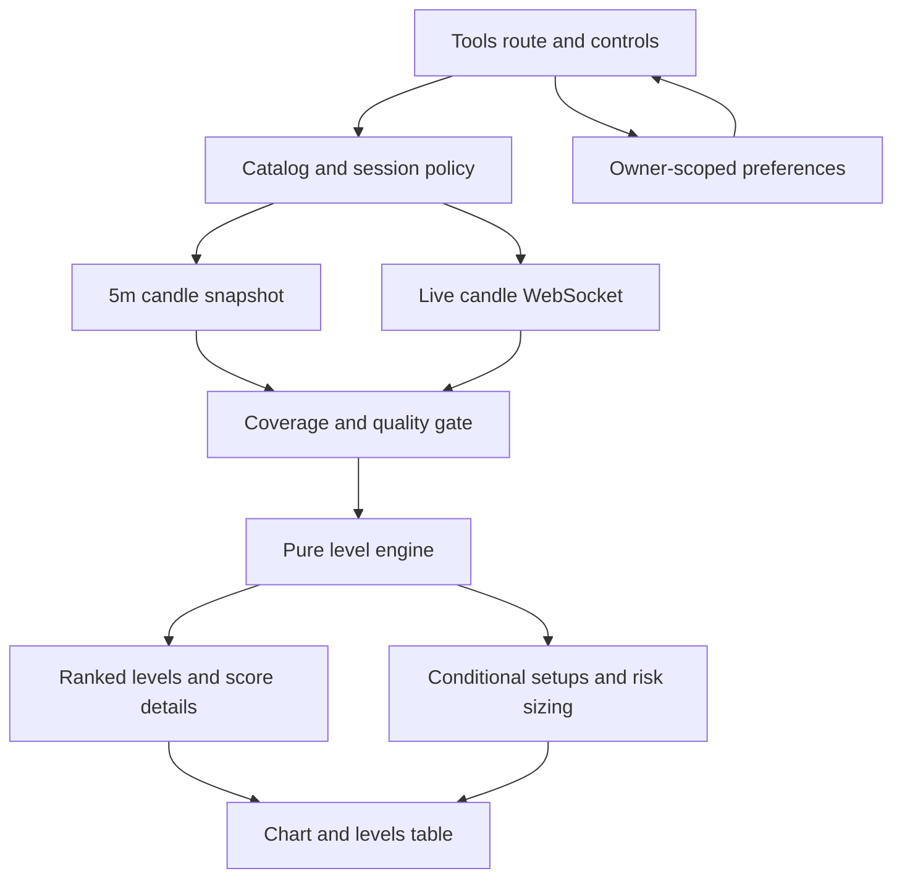

# Level Engine Tool - Plan

## Goal Capsule

- **Objective:** Add a routed `LEVELS` tool that turns live Hyperliquid OHLCV into ranked support and resistance zones plus four conditional trade maps for positions held from several hours to about two days.
- **Authority:** The supplied Python engine owns the initial mathematical behavior. The approved browser-native approach, explicit session labeling, and venue-volume disclosure constrain the port.
- **Execution profile:** Implement numerical behavior with fixture-backed pure functions before integrating the live UI.
- **Stop conditions:** Do not label a setup actionable when required history is incomplete, stale, or invalid. Do not imply Hyperliquid perp volume is consolidated underlying-market volume.
- **Tail ownership:** Complete numerical tests, browser integration checks, Supabase migration tests, production deployment, and live asset verification.

---

## Product Contract

### Summary

The Tools view gains a `LEVELS` subtab that automatically analyzes any Hyperliquid asset without a CSV upload. It presents the market regime, ranked price zones, conditional long and short setups, and risk-sized shares while retaining the supplied engine's rule that a zone is context rather than an automatic order.

### Problem Frame

The Python engine is useful but isolated from the app, requires manually prepared CSV data, and renders static files. Hyperdata already has searchable assets, 5-minute historical candles, a live candle WebSocket, Lightweight Charts, authentication, and Supabase. The feature should use those existing capabilities while making input quality and venue-specific limitations visible.

### Requirements

**Analysis inputs and lifecycle**

- R1. The tool shall analyze any asset in the existing Hyperliquid market catalog from the most recent available 5-minute OHLCV history.
- R2. The tool shall exclude the open 5-minute candle from ATR, swing confirmation, level scoring, and setups, then recompute after the candle closes or the user refreshes.
- R3. The tool shall show data coverage, last completed bar, freshness, selected session definition, and any quality condition that prevents a trustworthy result.
- R4. The tool shall prevent stale asset requests or WebSocket messages from replacing the currently selected asset's result.

**Engine behavior**

- R5. The JavaScript engine shall preserve the supplied candidate sources, source weights, ATR formulas, clustering tolerance, score components, regime rules, setup rules, and risk sizing as the initial canonical model.
- R6. The engine shall use explicit session/timezone grouping for prior-session, opening-range, VWAP, and weekly candidates rather than silently treating UTC calendar dates as exchange sessions.
- R7. The output shall disclose that volume-derived metrics use Hyperliquid perpetual volume, not consolidated underlying-market volume.
- R8. The engine shall return explainable score components and source identities for every ranked zone.

**Utility interface**

- R9. `#/tools/levels` shall expose an asset picker, risk-dollar input, session selector, visible-level limit, refresh action, summary metrics, an annotated candlestick chart, a levels table, and a setups table.
- R10. Selecting a level row shall emphasize the matching chart zone and reveal its score composition and sources.
- R11. The tool shall export the current levels and setups as CSV files.
- R12. The interface shall remain compact, dark, responsive, and consistent with the existing utility styling.

**Persistence**

- R13. A signed-in user's selected asset, risk budget, session mode, and visible-level limit shall persist through Supabase and synchronize across browsers.
- R14. The tool shall remain usable with in-memory defaults when the user is signed out or preference persistence fails.

### Acceptance Examples

- AE1. Given 5,000 valid DRAM 5-minute candles and an open current candle, when analysis runs, then only completed candles contribute to derived levels and the UI identifies the excluded live bar.
- AE2. Given a high-scoring support cluster made from prior-session low, a 60-minute swing low, and volume-profile VAL, when the row is selected, then the matching zone is emphasized and all three sources plus score components are shown.
- AE3. Given a $500 risk budget and a setup with $2.40 entry-to-stop risk, when the setup renders, then risk-sized shares equal `floor(500 / 2.40)`.
- AE4. Given a rapid switch from PLTR to NVDA while PLTR history is still loading, when the PLTR response completes last, then it is discarded and NVDA remains displayed.
- AE5. Given insufficient or stale history, when analysis cannot satisfy the engine's input contract, then no setup is labeled actionable and the blocking condition is visible.

### Scope Boundaries

In scope: deterministic analysis, live closed-bar refresh, compact visualization, CSV exports, and preference persistence.

### Deferred to Follow-Up Work

- True tick-level volume-at-price and order-book liquidity.
- Underlying consolidated-tape volume, premarket feeds, earnings exclusions, news-event filters, and options positioning.
- Walk-forward setup backtesting, MAE/MFE, realized hit rates, and strategy automation.
- Chart PNG export if the chart library cannot expose a stable cross-browser snapshot without extra machinery.

---

## Planning Contract

### Key Technical Decisions

- KTD1. **Port the engine to pure browser-side JavaScript.** (session-settled: user-approved — chosen over hosting the supplied Python process or requiring CSV uploads: the app already exposes Hyperliquid history and must remain deployable on GitHub Pages.) The numerical core remains independent of DOM, network, and Supabase code so fixtures can prove parity.
- KTD2. **Use one bounded 5-minute snapshot plus one candle subscription per active asset.** Hyperliquid exposes at most 5,000 recent candles and charges response-size-dependent request weight. Cache completed history in memory, abort superseded requests, and avoid periodic REST refetches while the WebSocket is healthy.
- KTD3. **Recompute on closed bars, not mark ticks.** (session-settled: user-approved — chosen over re-running the full engine every second: incomplete swings and ATR values would move before confirmation.) The live mark and active candle update continuously, while derived zones remain tied to the latest completed 5-minute bar.
- KTD4. **Make session semantics explicit and category-aware.** Default equities and ETFs to New York regular hours and other categories to UTC 24-hour grouping, while allowing the user to change the session mode. Results always display the chosen mode because Hyperliquid does not provide an authoritative per-market exchange-session calendar through the candle endpoint.
- KTD5. **Treat Hyperliquid volume as venue-specific.** Volume profile, VWAP, and volume bonuses are valid only as Hyperliquid perpetual-market features. The UI and exports carry that provenance.
- KTD6. **Persist only preferences, not computed analysis.** A small owner-scoped Supabase row stores configuration. Levels and setups are deterministic derivatives of current candle history and are recomputed rather than persisted.

### High-Level Technical Design

The data adapter owns request cancellation, completed-bar detection, session grouping, and cache freshness. The engine owns numerical transformations only. The view owns selection, presentation, downloads, and live-status messaging.

### Sources and Constraints

- `public/lib/hyperliquid.js` already owns candle normalization, the 5,000-bar cap, and supported intervals.
- `public/asset-chart.js` provides the existing Lightweight Charts configuration and establishes the chart visual language.
- `public/scaling.js` and `public/lib/scaling-simulator.js` establish the routed Tools pattern and pure-calculation boundary.
- Hyperliquid's official Info endpoint documents the 5,000-candle maximum and HIP-3 asset prefix requirement: https://hyperliquid.gitbook.io/hyperliquid-docs/for-developers/api/info-endpoint
- Hyperliquid's official rate-limit documentation assigns additional weight per 60 candles returned: https://hyperliquid.gitbook.io/hyperliquid-docs/for-developers/api/rate-limits-and-user-limits
- Hyperliquid's official WebSocket documentation provides live candle subscriptions: https://hyperliquid.gitbook.io/hyperliquid-docs/for-developers/api/websocket/subscriptions

---

## Implementation Units

### U1. Deterministic level engine

- **Goal:** Port the supplied numerical engine into pure JavaScript with explainable outputs.
- **Requirements:** R5, R6, R8; AE2, AE3.
- **Dependencies:** None.
- **Files:** `public/lib/level-engine.js`, `test/level-engine.test.js`, `test/fixtures/level-engine/*.json`.
- **Approach:** Implement normalized OHLCV validation, resampling, Wilder ATR, session VWAP, candidate generation, swing confirmation, approximate volume profile, round numbers, clustering, score decomposition, regime scoring, target selection, and setup construction. Preserve canonical constants in one exported model configuration. Represent timestamps as epoch milliseconds internally and make session grouping an injected policy.
- **Execution note:** Build from parity fixtures before integrating the UI. Use Python-generated expected summaries for representative trending, ranging, sparse-volume, and invalid datasets.
- **Patterns to follow:** Pure input/output functions and validation style in `public/lib/scaling-simulator.js`.
- **Test scenarios:**
  1. A known OHLCV fixture reproduces expected ATR, VWAP, candidate prices, zone centers, scores, regime, and setup sizing within declared numeric tolerances.
  2. Centered swing detection excludes unconfirmed trailing highs and lows.
  3. Duplicate candidate sources contribute only the strongest source weight plus the bounded repeat bonus.
  4. Zero-volume data falls back for VWAP and omits volume-profile candidates without producing non-finite values.
  5. Invalid high/low relationships, negative volume, duplicate timestamps, and insufficient bars produce deterministic validation results.
  6. New York session grouping handles daylight-saving offsets and does not merge adjacent sessions.
- **Verification:** Every exported calculation is deterministic, finite for valid input, and covered by fixture or focused boundary tests.

### U2. Hyperliquid analysis data adapter

- **Goal:** Supply fresh, completed, correctly attributed candles to U1 without excessive API use or cross-asset races.
- **Requirements:** R1-R4, R6, R7; AE1, AE4, AE5.
- **Dependencies:** U1.
- **Files:** `public/lib/level-data.js`, `public/lib/hyperliquid.js`, `test/level-data.test.js`, `test/hyperliquid.test.js`.
- **Approach:** Reuse the existing 5-minute snapshot and normalization path. Add abort support where needed, retain up to 5,000 candles per asset in a bounded in-memory cache, separate completed candles from the current open candle, and derive coverage and quality metadata. Map catalog categories to explicit default session policies while preserving the user's override.
- **Patterns to follow:** Candle load-token and WebSocket ownership checks in `public/app.js`; quote-stream lifecycle in `public/scaling.js`.
- **Test scenarios:**
  1. A snapshot ending in an open candle returns that candle separately and excludes it from analysis input.
  2. A late response for an abandoned asset cannot publish over the active asset.
  3. A closed WebSocket schedules one bounded reconnect and does not create duplicate subscriptions.
  4. A cached completed history is reused until a new completed bar requires recomputation.
  5. Gaps, stale last bars, fewer than 80 usable bars, and malformed candle fields produce named quality blockers.
  6. HIP-3 identifiers retain their dex prefix in REST and WebSocket requests.
- **Verification:** The adapter makes no repeated full-history request during a healthy active session and provides U1 only validated completed bars.

### U3. Routed Levels interface and exports

- **Goal:** Add the compact `LEVELS` tool, visual level map, explainable tables, and CSV downloads.
- **Requirements:** R3, R7-R12; AE1-AE5.
- **Dependencies:** U1, U2.
- **Files:** `public/index.html`, `public/styles.css`, `public/levels.js`, `public/asset-chart.js`, `public/lib/routes.js`, `test/levels-view.test.js`, `test/routes.test.js`, `package.json`.
- **Approach:** Extend the existing Tools subtab route and AssetPicker pattern. Add compact controls and status metrics, a chart adapter that can render and select zone bands, two responsive tables, score-detail disclosure, and escaped CSV downloads. Keep level selection synchronized between chart and table without making the chart the only way to inspect data.
- **Patterns to follow:** Tools routing in `public/lib/routes.js` and `public/app.js`; compact form and chart behavior in `public/scaling.js`; existing dark table styles in `public/styles.css`.
- **Test scenarios:**
  1. `#/tools/levels` resolves canonically, selects the LEVELS tab, and hides SCALING.
  2. Selecting an asset loads analysis and switching assets clears stale chart/table state immediately.
  3. Selecting a level row highlights only its matching chart band and renders score components and sources.
  4. Insufficient data renders the quality blocker and no actionable setup label.
  5. Levels and setups downloads contain the current asset, venue-volume provenance, visible values, and correctly escaped fields.
  6. Narrow-screen tables remain horizontally usable without hiding control labels or status information.
- **Verification:** The complete tool is keyboard-accessible, touch-usable, visually consistent, and functional without a signed-in user.

### U4. Cross-browser preference persistence

- **Goal:** Synchronize personal Levels configuration without persisting derived market analysis.
- **Requirements:** R13, R14.
- **Dependencies:** U3.
- **Files:** `supabase/migrations/202608040006_level_tool_preferences.sql`, `supabase/tests/level_tool_preferences_test.sql`, `public/levels.js`, `test/levels-view.test.js`.
- **Approach:** Add one owner-keyed row with validated asset, risk budget, session mode, and visible-level limit. Apply owner-only RLS and authenticated CRUD grants. Load after authentication, debounce writes, protect optimistic local state from stale polling responses, and retain defaults on failure.
- **Patterns to follow:** Owner/RLS policy and stale-refresh protection used by `hyperliquid_account_position_tags` and `public/trade-log.js`.
- **Test scenarios:**
  1. An authenticated owner can insert, update, and read one preference row while another user cannot access it.
  2. Invalid session modes, non-positive risk budgets, and out-of-range visible-level counts fail database constraints.
  3. A stale preference response cannot overwrite a newer local edit.
  4. Signed-out and failed-write states leave the tool usable with in-memory settings.
- **Verification:** Database policy tests pass and two signed-in browser sessions converge on the latest saved configuration.

---

## Verification Contract

| Gate | Applies to | Done signal |
|---|---|---|
| `npm test` | U1-U4 | Numerical, adapter, routing, UI contract, and persistence tests pass. |
| `npm run check` | U1-U4 | Every new browser module and modified script parses successfully. |
| `npm run test:edge` | Integration regression | Existing Supabase functions remain green. |
| `npm run test:db` | U4 | Migration constraints, grants, and RLS behavior pass with the full schema suite. |
| Browser smoke test | U2-U4 | DRAM, XYZ100, PLTR, and BTC load; levels render; live candles advance; selection and CSV exports work on desktop and narrow viewport. |
| Production verification | U3-U4 | GitHub Pages serves the cache-bumped bundle and the production migration is recorded successfully. |

---

## Definition of Done

- All R1-R14 behavior is implemented and all AE1-AE5 scenarios are demonstrable.
- Numerical parity fixtures protect the supplied engine's initial formulas and weights.
- No open candle contributes to confirmed analysis, and the last completed bar is visible.
- The selected session definition and Hyperliquid-volume limitation are present in the UI and exports.
- Rapid asset changes, stale responses, WebSocket reconnects, and API failures cannot corrupt the active result.
- Preference persistence is owner-scoped and failure-tolerant.
- All verification gates pass, the branch is reviewed and merged, Supabase migrations deploy, and the live GitHub Pages bundle is verified.
- Experimental, abandoned, or duplicate implementation paths are removed before completion.
